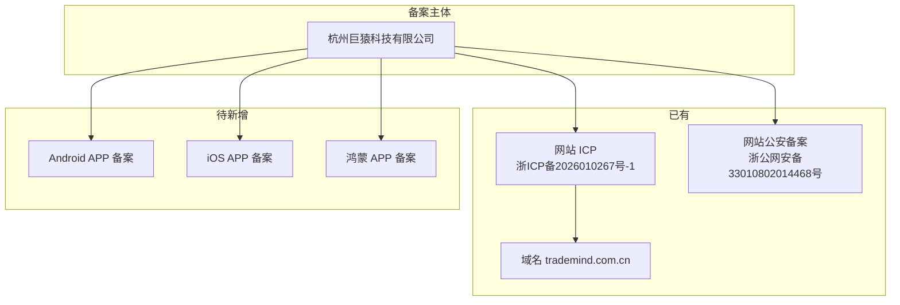
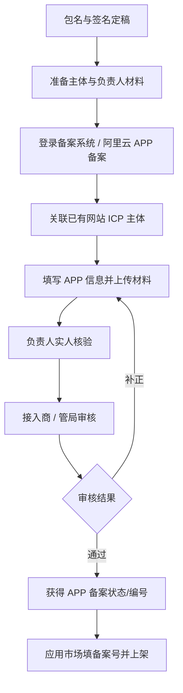

# TradeMind 移动互联网应用程序（APP）备案材料填写模板

> **文档版本**：v1.0  
> **适用产品**：TradeMind 商贸智脑  
> **运营主体**：杭州巨猿科技有限公司  
> **关联网站 ICP**：浙ICP备2026010267号-1  
> **关联网站公安备案**：浙公网安备33010802014468号  
> **服务域名**：`trademind.com.cn`  
> **关联文档**：`spec.md`、`应用市场上架字段对照表.md`  
> **说明**：本文档为备案填表与材料筹备的操作模板；包名、负责人手机号等「待填」项须在开发定稿后一次性确认，备案通过后变更成本高。

---

## 1. 备案性质与前置结论

### 1.1 是否需要新立 ICP / 公安备案主体？

| 事项 | 结论 | 说明 |
|------|------|------|
| ICP 主体备案 | **不需要新立主体** | 沿用网站备案主体「杭州巨猿科技有限公司」 |
| 公安联网备案（网站） | **不需要重复办理网站备案** | 网站已有浙公网安备33010802014468号 |
| APP 备案 | **必须办理** | 在现有 ICP 主体下为每个移动应用程序新增登记 |
| 软件著作权 | **强烈建议同步办理** | 国内应用商店上架常用，与备案可并行 |

### 1.2 APP 备案与网站备案的关系



### 1.3 办理入口（择一）

| 方式 | 入口 | 适用场景 |
|------|------|----------|
| 自行办理 | 工信部 ICP/IP 地址/域名信息备案管理系统（及各地通信管理局指引） | 有备案经验、时间充裕 |
| 接入商代办 | 阿里云 / 腾讯云等「APP 备案」产品（域名与服务器在对应云） | 与现网基础设施同云时效率高 |
| 第三方代办 | 合规代理机构 | 人力不足时，需核验资质 |

**TradeMind 现网**：域名 `trademind.com.cn`、后端网关与 OSS 在阿里云场景下，**优先通过阿里云备案控制台「APP 备案」** 关联已有网站 ICP 主体。

---

## 2. 备案前定稿清单（必须先于填表）

以下信息一旦提交备案，与国内应用市场上架、签名证书强绑定，**变更需重新备案或走变更流程**。

### 2.1 三端包名 / Bundle ID（待项目组定稿）

| 平台 | 字段名 | 建议格式 | 示例（待确认） | 定稿状态 |
|------|--------|----------|----------------|----------|
| Android | `applicationId` / 包名 | `com.<公司简称>.<产品>` | `com.juyuan.trademind` | ☐ 待填 |
| iOS | Bundle Identifier | 与 Android 建议一致 | `com.juyuan.trademind` | ☐ 待填 |
| 鸿蒙 | `bundleName` | 与 Android 建议一致 | `com.juyuan.trademind` | ☐ 待填 |

### 2.2 应用名称（各平台展示名可略有差异，备案用主名称）

| 项 | 内容 | 定稿状态 |
|----|------|----------|
| 中文名称 | TradeMind 商贸智脑 | ☐ |
| 英文名称（如有） | TradeMind | ☐ |
| 简称 | 商贸智脑 | ☐ |

### 2.3 版本与签名

| 项 | 首版建议 | 定稿状态 |
|----|----------|----------|
| 首版版本号 | `1.0.0` | ☐ |
| Android 签名证书 | Release Keystore（备份至安全存储） | ☐ |
| iOS 分发证书 | Apple Distribution + App Store Connect | ☐ |
| 鸿蒙签名 | 华为 AGConnect 配置 | ☐ |

### 2.4 服务与域名（与现网一致）

| 项 | 内容 |
|----|------|
| 主域名 | `trademind.com.cn` |
| API 网关入口 | `https://trademind.com.cn/api`（经 Nginx 反代） |
| 隐私政策 URL | `https://trademind.com.cn/privacy.html`（上线前须可访问） |
| 用户协议 URL | `https://trademind.com.cn/terms.html`（上线前须可访问） |

---

## 3. 主体与负责人信息模板

### 3.1 备案主体（单位）

| 填表字段 | 填写内容 |
|----------|----------|
| 主办单位名称 | 杭州巨猿科技有限公司 |
| 主办单位性质 | 企业 |
| 证件类型 | 营业执照 |
| 证件号码 | 【待填：营业执照统一社会信用代码】 |
| 证件住所 | 【待填：注册地址】 |
| 通信地址 | 【待填：与营业执照或实际办公一致】 |

### 3.2 网站负责人 / APP 负责人（通常同一人或法人）

| 填表字段 | 填写内容 |
|----------|----------|
| 姓名 | 【待填】 |
| 证件类型 | 居民身份证 |
| 证件号码 | 【待填】 |
| 手机号码 | 【待填：需实人核验】 |
| 电子邮箱 | 【待填】 |

### 3.3 应急联系人

| 填表字段 | 填写内容 |
|----------|----------|
| 姓名 | 【待填】 |
| 手机号码 | 【待填】 |
| 电子邮箱 | 【待填】 |

---

## 4. APP 基本信息填表模板

以下为工信部 APP 备案系统常见字段及 **TradeMind 推荐填写内容**。实际界面字段名以备案系统当期版本为准。

### 4.1 单条 APP 登记（Android 示例）

| 系统字段（常见名称） | 填写内容 | 备注 |
|----------------------|----------|------|
| APP 名称 | TradeMind 商贸智脑 | 与商店展示名一致 |
| APP 图标 | 512×512 PNG | 与上架素材一致 |
| 运行平台 | Android | iOS / 鸿蒙各登记一条 |
| 包名 | 【见 §2.1 定稿值】 | 与 APK 一致 |
| 公钥 / 签名信息 | 上传 Release 证书公钥或按系统指引提取 | Android 需 SHA256 等 |
| 是否提供 SDK 化 | 否 | 独立 APP，非 SDK |
| APP 类型 | 工具 / 商务 | 选「商务」或「工具-办公商务」 |
| 服务类目 | 企业管理 / 效率办公 | 以系统选项为准 |
| 是否涉及第三方 SDK | 是 | 见 §4.4 |
| 是否收集个人信息 | 是 | 见 §5 隐私清单 |
| 服务器放置地 | 中国境内 | 阿里云国内节点 |
| 关联域名 | trademind.com.cn | 须已 ICP 备案 |
| APP 功能描述 | 见 §4.2 | 可直接粘贴 |
| 备注 | 混合壳加载 H5，B2B 商贸 ERP | 可选 |

### 4.2 APP 功能描述（500 字以内，可直接用于备案）

```
TradeMind 商贸智脑是一款面向中小微批发、电商、外贸、工贸企业的 B2B 智能经营管理移动应用。用户通过账号密码登录后，可使用工作台进行订单管理、客户 CRM、产品库存查询、供应商管理及智能经营分析；支持语音、图片等方式辅助录单。应用数据通过 HTTPS 与部署在境内的服务器交互，采用多租户隔离与角色权限控制。应用内会员订阅通过合规支付渠道完成。本应用不向个人消费者提供社交、新闻、视频等内容服务，主要服务于企业商户日常经营场景。
```

### 4.3 iOS / 鸿蒙登记差异项

| 平台 | 额外字段 | 填写要点 |
|------|----------|----------|
| iOS | Bundle ID | 与 Apple Developer 一致 |
| iOS | 公钥 / 证书 | 从 Apple 分发证书或 App Store Connect 导出指引提取 |
| 鸿蒙 | bundleName | 与华为 AGC 应用一致 |
| 鸿蒙 | 软件包类型 | 应用（非元服务时选应用） |

### 4.4 第三方 SDK 清单（备案常见要求）

| SDK / 服务 | 提供方 | 用途 | 收集信息类型 |
|------------|--------|------|----------------|
| 阿里云 OSS | 阿里云计算 | 图片/语音文件存储 | 用户上传的文件 |
| 阿里百炼 / DashScope | 阿里巴巴 | AI 订单识别 | 用户上传的语音、图片（经服务端） |
| 杭州银行统一收银台 | 杭州银行 | 会员订阅支付 | 订单号、金额（支付由银行处理） |
| （若接入）崩溃统计 | 友盟 / Firebase 等 | 稳定性监控 | 设备型号、崩溃日志 |
| （若接入）推送 | 华为 / 苹果 APNs 等 | 消息通知 | 设备 Token |

**填表原则**：仅列 **实际接入** 的 SDK；未接入的推送/统计不要在备案材料中写。

---

## 5. 个人信息收集清单（备案 + 隐私政策对齐）

与现网 `TradeMind-Web` 能力对齐，备案与隐私政策须 **一致**。

| 信息类型 | 是否收集 | 业务场景 | 存储位置 | 是否共享第三方 |
|----------|----------|----------|----------|----------------|
| 手机号 | 是 | 注册、登录、短信验证 | 境内数据库 | 否（短信通道仅发码） |
| 账号密码 | 是 | 登录认证 | 境内数据库（密码哈希） | 否 |
| 企业/租户名称 | 是 | 多租户标识 | 境内数据库 | 否 |
| 客户/订单等业务数据 | 是 | ERP 核心功能 | 境内数据库 | 否 |
| 相机 / 相册 | 是 | AI 识图、上传图片 | OSS（境内） | 阿里云 |
| 麦克风 | 是 | 语音录单 | OSS（境内） | 阿里云 + AI 服务 |
| 设备信息 | 可选 | 崩溃统计、风控（若接入） | 境内或统计服务商 | 视 SDK |
| 精确地理位置 | 否 | — | — | — |
| 通讯录 | 否 | — | — | — |

### 5.1 权限与系统弹窗说明（Android / iOS / 鸿蒙填表用）

| 权限 | Android 权限名 | iOS 用途说明 | 鸿蒙权限 | 是否可关闭 |
|------|----------------|--------------|----------|------------|
| 网络 | INTERNET | 网络访问 | 网络 | 否（核心功能） |
| 相机 | CAMERA | 拍摄单据/商品 | 相机 | 是（不用识图可不授） |
| 相册 | READ_MEDIA_IMAGES 等 | 选择图片 | 媒体读取 | 是 |
| 麦克风 | RECORD_AUDIO | 语音录单 | 麦克风 | 是 |
| 存储 | 视系统版本 | 缓存（若本地包） | 文件 | 视实现 |

---

## 6. 材料清单与文件模板

### 6.1 电子版材料 checklist

| # | 材料名称 | 格式 | 状态 |
|---|----------|------|------|
| 1 | 营业执照副本扫描件 | JPG/PDF | ☐ |
| 2 | 负责人身份证正反面 | JPG/PDF | ☐ |
| 3 | APP 图标 512×512 | PNG | ☐ |
| 4 | Android 签名公钥 / 证书指纹说明 | 按系统模板 | ☐ |
| 5 | iOS 证书公钥（若登记 iOS） | 按系统模板 | ☐ |
| 6 | 隐私政策网页（可访问 URL） | HTTPS 链接 | ☐ |
| 7 | 用户协议网页（可访问 URL） | HTTPS 链接 | ☐ |
| 8 | 软件著作权证书（部分接入商要求） | PDF | ☐ |
| 9 | APP 安装包样例（部分场景） | APK/IPA | ☐ |
| 10 | 授权委托书（负责人非法人时） | 扫描件 | ☐ |

### 6.2 隐私政策页面必备章节（网页须上线）

1. 引言与适用范围  
2. 运营主体名称与联系方式  
3. 收集个人信息的目的、方式、范围  
4. 第三方 SDK 目录  
5. 存储期限与地点（境内）  
6. 用户权利（查询、更正、删除、注销账号）  
7. 未成年人保护  
8. 政策更新方式  
9. 投诉与举报渠道  

### 6.3 应用内「关于」页展示（与网站页脚一致）

| 展示项 | 内容 |
|--------|------|
| 版权 | © 2026 杭州巨猿科技有限公司 |
| ICP | 浙ICP备2026010267号-1（链接 `https://beian.miit.gov.cn/`） |
| 公安备案 | 浙公网安备33010802014468号（链接 `https://beian.mps.gov.cn/`） |
| 隐私政策 | 可点击链接 |
| 用户协议 | 可点击链接 |
| APP 备案号 | 备案通过后补充展示 |

---

## 7. 办理流程与时间线



| 阶段 | 典型周期 | 负责角色 |
|------|----------|----------|
| 材料筹备 | 3~7 个工作日 | 运营 + 法务 + 技术 |
| 提交与实人核验 | 1~3 个工作日 | 运营 |
| 审核 | 20~40 个工作日 | 管局 / 接入商 |
| 备案号同步商店 | 1~2 个工作日 | 运营 |

---

## 8. 备案与开发 / 上架的衔接

### 8.1 顺序建议

1. **定稿包名** → 2. **启动 APP 备案** → 3. **并行软著与壳开发** → 4. **备案通过** → 5. **国内商店提审**

国内华为、小米、应用宝等常在提审时校验备案状态，**不宜等开发完成才备案**。

### 8.2 备案信息变更场景

| 变更类型 | 影响 | 建议 |
|----------|------|------|
| 包名变更 | 需重新备案 | 开发前一次性定稿 |
| 主体变更 | 重新主体备案 | 避免 |
| 功能重大变更（如新增直播） | 可能需变更备案 | 发版前评估 |
| 仅 H5 业务迭代 | 通常无需变更 | 远程 H5 模式优势 |

### 8.3 与杭州银行支付的关系

- APP 备案 **不替代** 支付业务许可；TradeMind 会员订阅走 **杭州银行收银台**，属商户收款场景。  
- 若应用市场询问「是否持牌支付」，说明：**平台不提供资金账户服务，订阅费用经持证银行收银台完成**。

---

## 9. 软著登记并行模板（上架常用）

与 APP 备案可 **同时提交**，材料与 `说明.txt` 中软著字段对齐。

| 软著字段 | 填写参考 |
|----------|----------|
| 软件全称 | TradeMind 商贸智脑软件 |
| 软件简称 | 商贸智脑 |
| 版本号 | V1.0 |
| 开发完成日期 | 【首版发布前日期】 |
| 首次发表日期 | 【首版上架日期】 |
| 权利范围 | 全部权利 |
| 著作权人 | 杭州巨猿科技有限公司 |
| 源程序量 | 参考 `说明.txt`（约 74530 行，以当期统计为准） |
| 开发目的 | 为中小微批发、电商、外贸、工贸企业提供智能一体化经营管理平台 |
| 主要功能 | 见 `说明.txt` §10 或本文 §4.2 扩展版 |

---

## 10. 填表前终审 checklist

| # | 检查项 | 通过 |
|---|--------|------|
| 1 | 包名三端已定稿且与工程配置一致 | ☐ |
| 2 | 备案主体与营业执照一致 | ☐ |
| 3 | 域名 `trademind.com.cn` ICP 有效 | ☐ |
| 4 | 隐私政策 / 用户协议 HTTPS 可访问 | ☐ |
| 5 | APP 功能描述无虚假宣传 | ☐ |
| 6 | SDK 清单与实际代码一致 | ☐ |
| 7 | 个人信息清单与隐私政策一致 | ☐ |
| 8 | 负责人手机可完成实人核验 | ☐ |
| 9 | Android / iOS 签名信息已提取 | ☐ |
| 10 | 软著已提交或已取得（商店需要） | ☐ |

---

## 11. 文档修订记录

| 版本 | 日期 | 修订说明 |
|------|------|----------|
| v1.0 | 2026-06-21 | 首版：TradeMind APP 备案填表与材料模板 |
