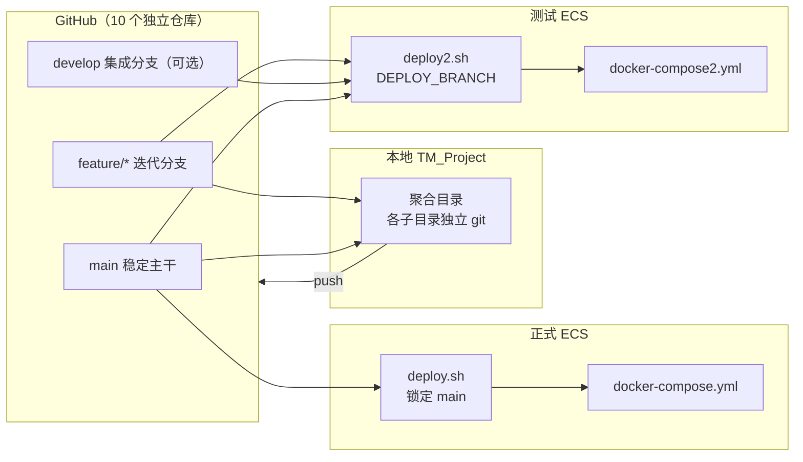
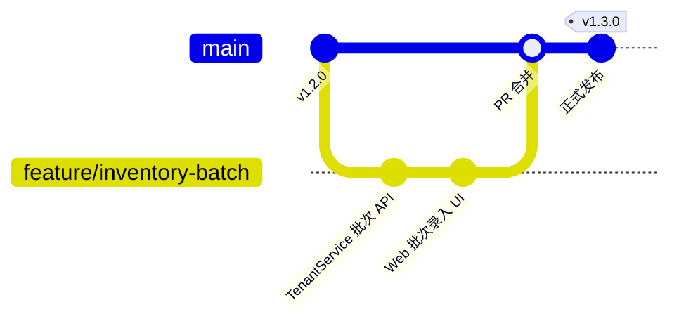

# 商贸智脑（TradeMind）Git 分支维护与开发同步方案

| 属性 | 内容 |
|------|------|
| 文档版本 | v1.0 |
| 创建日期 | 2026-06-21 |
| 文档状态 | 规范文档（待团队确认） |
| 关联文档 | `spec.md`（系统概要设计）、`deploy.sh`（正式 ECS 部署）、`deploy2.sh`（测试 ECS 部署）、`docker-compose2.yml` |
| 适用范围 | 全部微服务仓库、前端仓库、ECS 正式/测试环境部署与日常开发协作 |

---

## 1. 概述

### 1.1 背景

商贸智脑采用 **多仓库微服务架构**：各后端服务、网关、前端在 GitHub 上为 **独立 Git 仓库**，本地 `TM_Project` 为聚合开发目录（本身不是 Git 仓库）。ECS 通过 `deploy.sh` / `deploy2.sh` 按模块名逐仓 `clone` / `pull` 后 Docker 构建部署。

随着功能持续迭代，需满足以下约束：

| 诉求 | 说明 |
|------|------|
| 线上稳定 | 正式 ECS **只运行 `main` 主干上已验收的稳定版本** |
| 迭代隔离 | 新功能在独立分支开发，**不影响线上运行** |
| 测试灵活 | 测试 ECS 可 **切换到指定分支** 验证最新迭代 |
| 多仓协同 | 跨服务大功能时，各仓库分支命名与部署策略需 **可对照、可复现** |

### 1.2 设计目标

1. **主干即生产**：`main` 分支代表可上线代码；正式 ECS 仅部署 `main`。
2. **分支即迭代**：单次功能/版本迭代使用 `feature/*`（或 `hotfix/*`）分支，测试环境按需切换。
3. **合并即发布**：功能验收通过后通过 Pull Request 合并至 `main`，打 Tag 标记版本，再在正式 ECS 执行部署。
4. **环境物理隔离**：正式与测试使用不同目录、不同 Compose 文件、不同容器名与端口，与 Git 分支策略叠加形成双保险。

### 1.3 非目标（本规范不覆盖）

- GitHub Actions / CI 流水线具体配置（可后续单独文档）。
- 数据库迁移脚本的版本管理细则（见 `Database_Deployment_Guide.md`）。
- 修改 `TM_Project` 为 Monorepo 的方案（当前明确 **不采用**）。

---

## 2. 仓库与部署架构

### 2.1 独立仓库清单

以下 10 个模块各自对应 GitHub 上的一个仓库（仓库名与目录名一致）：

| 序号 | 目录 / 仓库名 | 说明 |
|------|---------------|------|
| 1 | InitCfgService | 初始化配置服务 |
| 2 | trademind-gateway | API 网关 |
| 3 | TenantService | 租户与核心业务（含 CFCA JAR） |
| 4 | AIService | AI 智能录单 |
| 5 | RDService | 研发/生产相关 |
| 6 | CRMService | 客户关系 |
| 7 | SuppService | 供应商 |
| 8 | IMService | 即时通讯 |
| 9 | OpsService | 运维中台 |
| 10 | TradeMind-Web | 前端 |

> **注意**：`TM_Project` 根目录下的 `deploy.sh`、`deploy2.sh`、`docker-compose.yml`、`docker-compose2.yml` 等编排文件需 **单独维护**（可通过某运维仓库或手工同步至 ECS），不在上述 10 个服务仓库的 `git pull` 范围内。

### 2.2 双 ECS 环境对照

| 维度 | 正式环境（线上） | 测试环境 |
|------|------------------|----------|
| 建议目录 | 正式 ECS 部署根目录 | `/opt/trademind-test` |
| 部署脚本 | `deploy.sh` | `deploy2.sh` |
| Compose 文件 | `docker-compose.yml` | `docker-compose2.yml` |
| 项目名 / 容器前缀 | 默认服务名 | `trademind-test` / `test-*` |
| 对外入口 | 正式域名 / 端口 | Nginx `8443`（HTTPS） |
| **Git 分支策略** | **仅 `main`** | **`main` 或指定迭代分支** |

### 2.3 整体数据流



---

## 3. 分支模型

### 3.1 分支类型与职责

```
main                    ← 生产稳定线，仅合并已验收代码
  │
  ├── develop（可选）   ← 多功能并行时的集成分支
  │
  ├── feature/<简述>    ← 单次功能 / 版本迭代
  ├── feature/<简述>
  │
  └── hotfix/<简述>     ← 线上紧急修复
```

| 分支 | 命名示例 | 用途 | 部署目标 |
|------|----------|------|----------|
| `main` | `main` | 已验收、可上线的稳定代码 | **仅正式 ECS** |
| `develop` | `develop` | 多个 feature 先集成联调（团队可选） | 测试 ECS |
| `feature/*` | `feature/inventory-batch` | 单次迭代开发 | 测试 ECS |
| `hotfix/*` | `hotfix/payment-callback` | 线上缺陷紧急修复 | 先测试 ECS，验证后合 `main` |

### 3.2 分支命名规范

| 类型 | 格式 | 示例 |
|------|------|------|
| 功能迭代 | `feature/<英文短横线描述>` | `feature/product-spu-sku` |
| 紧急修复 | `hotfix/<英文短横线描述>` | `hotfix/jwt-expire` |
| 发布准备 | `release/<版本号>`（可选） | `release/v1.3.0` |

**约定：**

- 使用 **小写英文 + 短横线**，避免空格与中文（便于脚本与 PR 标题统一）。
- **跨服务联动**时，各相关仓库使用 **相同分支名**（如均为 `feature/inventory-batch`）。
- 合并完成后 **删除远程 feature 分支**（GitHub PR 勾选 delete branch），保持仓库整洁。

### 3.3 版本 Tag

在 `main` 上每次正式对外发布打 Tag，便于回滚与对账：

```bash
git checkout main
git pull origin main
git tag -a v1.3.0 -m "批次库存、产品 SPU/SKU 扩展"
git push origin v1.3.0
```

Tag 命名：`v<主>.<次>.<修订>`，与产品发布说明一致。

---

## 4. 日常开发流程

### 4.1 启动新迭代（单仓库）

以 `TenantService` 为例：

```bash
cd TenantService
git checkout main
git pull origin main
git checkout -b feature/inventory-batch

# 开发、本地编译测试 ...
git add .
git commit -m "feat(tenant): 支持批次库存维度查询"
git push -u origin feature/inventory-batch
```

### 4.2 跨服务大功能（多仓库同名分支）

当网关、租户服务、前端需同步改动时：

```bash
# 在每个涉及的仓库重复以下步骤，分支名保持一致
for repo in TenantService trademind-gateway TradeMind-Web; do
  cd "$repo"
  git checkout main && git pull origin main
  git checkout -b feature/inventory-batch
  cd ..
done

# 各仓开发完成后分别 push
cd TenantService && git push -u origin feature/inventory-batch
cd ../trademind-gateway && git push -u origin feature/inventory-batch
cd ../TradeMind-Web && git push -u origin feature/inventory-batch
```

### 4.3 与远程同步（开发中）

```bash
# 每日开始工作前：先更新本地 main，再 rebase/merge 到 feature
git checkout main
git pull origin main
git checkout feature/inventory-batch
git merge main          # 或 git rebase main（团队统一一种即可）

# 推送迭代分支
git push origin feature/inventory-batch
```

**建议**：功能开发周期超过 3 天时，至少每日从 `main` 合并一次，减少 PR 阶段冲突。

### 4.4 提交合并至主干（Pull Request）

1. 在 GitHub 创建 PR：`feature/inventory-batch` → `main`。
2. 填写变更说明、关联需求/issue（如有）。
3. Code Review 通过后 **Squash merge** 或 **Merge commit**（团队择一固定）。
4. 合并后在 `main` 打 Tag（见 §3.3）。
5. 删除已合并的 `feature/*` 远程分支。

### 4.5 线上 Hotfix 流程

```bash
git checkout main
git pull origin main
git checkout -b hotfix/payment-callback
# 修复、提交
git push -u origin hotfix/payment-callback

# 测试 ECS 验证 → PR 合并 main → 打 patch tag（如 v1.2.1）→ 正式 ECS deploy.sh
```

Hotfix 合并后，应 **同步 cherry-pick 或 merge 到未发布的 feature 分支**，避免修复只存在于 `main` 而迭代分支仍带 bug。

---

## 5. 提交规范

### 5.1 Commit Message 格式

采用简洁的 Conventional Commits 风格：

```
<type>(<scope>): <subject>

[optional body]
```

| type | 含义 |
|------|------|
| `feat` | 新功能 |
| `fix` | 缺陷修复 |
| `refactor` | 重构（无行为变化） |
| `docs` | 文档 |
| `chore` | 构建、依赖、脚本等 |
| `test` | 测试 |

**scope 示例**：`tenant`、`gateway`、`web`、`ai`、`crm`

**示例：**

```
feat(tenant): 进货单明细支持批次号入库
fix(gateway): 修复 JWT 过期后未返回 401
chore(web): 升级 Vite 至 5.4
```

### 5.2 提交粒度建议

- **一个逻辑变更一个 commit**（便于 review 与 revert）。
- **不要**把无关模块改动混在同一 commit。
- 含 `TenantService/lib/cfca/*.jar` 等大文件时，单独 commit 并在 PR 中说明原因。

---

## 6. ECS 部署与分支切换

### 6.1 正式环境（仅 main）

**原则：正式 ECS 永远只部署 `main`。**

当前 `deploy.sh` 对各模块执行 `git pull`（跟随当前 checkout 分支）。为防误操作，**推荐**在脚本中显式锁定：

```bash
# 推荐写入 deploy.sh 的同步逻辑（示意）
git fetch origin main
git checkout main
git reset --hard origin/main
```

正式环境部署步骤：

```bash
cd <正式 ECS 部署根目录>
# 确保 .env 中 GH_USER、GH_TOKEN 已配置
chmod +x deploy.sh
./deploy.sh
```

`deploy.sh` 会依次：同步 10 个仓库 → 校验 `TenantService/lib/cfca/SADK.jar` → `docker compose build` → `up -d`。

### 6.2 测试环境（可指定分支）

**原则：测试 ECS 通过环境变量指定分支，默认与 `main` 一致时可做回归。**

**推荐**增强 `deploy2.sh`，支持：

| 变量 | 含义 | 默认值 |
|------|------|--------|
| `DEPLOY_BRANCH` | 所有模块统一 checkout 的分支 | `main` |
| `DEPLOY_ROOT` | 部署根目录 | 脚本所在目录 |
| `COMPOSE_FILE` | Compose 文件 | `docker-compose2.yml` |

**用法示例：**

```bash
cd /opt/trademind-test

# 测试某迭代分支（全模块同名分支）
DEPLOY_BRANCH=feature/inventory-batch ./deploy2.sh

# 测试 develop 集成
DEPLOY_BRANCH=develop ./deploy2.sh

# 与线上一致的 main 回归
./deploy2.sh
```

**推荐**写入 `deploy2.sh` 的同步逻辑（示意）：

```bash
DEPLOY_BRANCH="${DEPLOY_BRANCH:-main}"

git fetch origin
git checkout "$DEPLOY_BRANCH"
git pull origin "$DEPLOY_BRANCH"
```

首次 clone 时指定分支：

```bash
git clone -b feature/inventory-batch "$REPO_URL"
```

### 6.3 按模块指定不同分支（进阶）

当「网关已合 main、租户服务仍在 feature」时，可在测试 ECS 部署根目录放置 `.deploy-branches`：

```ini
# /opt/trademind-test/.deploy-branches
# 格式：模块目录名=分支名（未列出的模块使用 DEPLOY_BRANCH 或 main）

TenantService=feature/inventory-batch
trademind-gateway=feature/inventory-batch
TradeMind-Web=feature/inventory-batch
AIService=main
CRMService=main
```

`deploy2.sh` 读取该文件时为各模块 checkout 对应分支（需脚本支持，见 §8.2 待办）。

### 6.4 部署前检查清单

| 检查项 | 正式 ECS | 测试 ECS |
|--------|----------|----------|
| 目标分支为 `main` | 必须 | 可选 |
| `.env` 中 GitHub Token 有效 | 是 | 是 |
| `SADK.jar` 体积正常（≥ 500KB） | 是 | 是 |
| 无未合并冲突（`git diff --diff-filter=U`） | 是 | 是 |
| 数据库迁移已与代码版本匹配 | 是 | 是 |
| 已在测试环境验收 | N/A | 合并 main 前必须 |

---

## 7. 多仓库开发同步方案

### 7.1 场景矩阵

| 场景 | 涉及仓库 | 分支策略 | 测试部署 |
|------|----------|----------|----------|
| 单服务小改动 | 1 个 | 仅该仓 `feature/*`，其余保持 `main` | `DEPLOY_BRANCH=feature/xxx`（未改动的仓需已在 main 且兼容） |
| 跨服务大功能 | 多个 | **同名** `feature/*` | `DEPLOY_BRANCH=feature/xxx` |
| 集成多 feature | 多个 | 各 feature → `develop` → `main` | 测试 `develop` |
| 线上 hotfix | 1～N 个 | `hotfix/*` → `main` | 先测 hotfix 分支 |
| 仅前端 UI | TradeMind-Web | 单独 `feature/*` | 仅 Web 分支切换（后端 main） |

### 7.2 本地 TM_Project 同步习惯

1. **各子目录独立 git**：在对应服务目录内执行分支操作，不要在 `TM_Project` 根目录执行 `git`。
2. **记录当前迭代矩阵**：在迭代文档或 issue 中维护「本功能涉及的仓库 + 分支名」表。
3. **联调前 pull**：测试 ECS 部署前，确认 GitHub 上各仓目标分支已 push 最新 commit。
4. **合并顺序建议**（跨服务时）：`InitCfgService`（如有 schema）→ 各后端 → `trademind-gateway` → `TradeMind-Web`，减少接口不一致窗口。

### 7.3 迭代分支与 main 漂移处理

| 情况 | 处理方式 |
|------|----------|
| feature 开发中 main 有其它合并 | 定期 `git merge main` 进 feature |
| PR 冲突 | 本地解决后 push，更新 PR |
| 迭代废弃 | 删除远程分支，测试 ECS 切回 `main` |
| 仅部分仓库合并 main | 测试环境用 `.deploy-branches` 区分 |

---

## 8. GitHub 仓库保护建议

在每个服务仓库 **Settings → Branches → Branch protection rules** 中为 `main` 配置：

| 规则 | 建议 |
|------|------|
| Require a pull request before merging | 开启 |
| Require approvals | ≥ 1（按团队规模） |
| Require status checks to pass | 有 CI 后开启 |
| Restrict pushes that create files | 禁止直接 push `main` |
| Allow force pushes | **禁止**（正式历史不可改写） |

**ECS 服务器侧：**

- 不要在 ECS 上直接修改已跟踪文件并 commit。
- 若 `deploy.sh` stash pop 冲突，按脚本提示 `git reset --hard origin/main` 恢复，再排查本地误改。

---

## 9. 完整迭代生命周期（示例）

以「产品批次库存」跨 `TenantService` + `TradeMind-Web` 为例：



| 阶段 | 动作 | 环境 |
|------|------|------|
| 1. 开分支 | 从 `main` 创建 `feature/inventory-batch`，push | 本地 |
| 2. 开发 | 各仓提交、push | 本地 |
| 3. 联调 | `DEPLOY_BRANCH=feature/inventory-batch ./deploy2.sh` | 测试 ECS |
| 4. 验收 | 测试通过，提 PR | GitHub |
| 5. 合并 | PR → `main`，打 `v1.3.0` | GitHub |
| 6. 上线 | `./deploy.sh`（仅 `main`） | 正式 ECS |
| 7. 收尾 | 删除 feature 分支；测试 ECS 可切回 `main` | — |

---

## 10. 常见问题（FAQ）

### Q1：TM_Project 根目录需要 init git 吗？

**不需要。** 分支策略落在各服务独立仓库；根目录仅作本地聚合与存放 `deploy*.sh`、`docker-compose*.yml`。

### Q2：测试环境拉了 feature 分支，会影响线上吗？

**不会。** 测试与正式是不同 ECS 目录、不同 Compose、不同端口与容器名；线上只要 `deploy.sh` 锁定 `main` 即可。

### Q3：只有一个仓库改动了，其它仓库要切 feature 吗？

**不需要。** 未改动的仓库在测试环境保持 `main`；若使用统一 `DEPLOY_BRANCH`，需保证该分支在未改动的仓库中与 `main` 一致（或从未创建过该分支则改用 §6.3 按模块配置）。

### Q4：`git pull` 失败或 TenantService 冲突怎么办？

按 `deploy.sh` 提示处理 unmerged 文件；常见情况为 ECS 上误改 README。恢复命令：

```bash
cd TenantService
git merge --abort 2>/dev/null
git fetch origin
git checkout main
git reset --hard origin/main
```

### Q5：CFCA JAR 如何随分支提交？

`TenantService/lib/cfca/` 下 JAR **仅在该仓库提交**，ECS 只 pull TenantService 远程。变更 JAR 时在 feature 分支单独 commit，测试 ECS 部署后脚本会校验 `SADK.jar` 大小。

---

## 11. 脚本增强待办（可选实施）

当前 `deploy.sh` / `deploy2.sh` 使用 plain `git pull`。为完全落实本规范，建议后续 PR 修改：

| 脚本 | 增强项 |
|------|--------|
| `deploy.sh` | 强制 `fetch + checkout main + reset --hard origin/main` |
| `deploy2.sh` | 支持 `DEPLOY_BRANCH` 环境变量 |
| `deploy2.sh` | 可选读取 `.deploy-branches` 按模块 checkout |
| `deploy2.sh` | 首次 `git clone -b "$BRANCH"` |

---

## 12. 附录

### 12.1 命令速查

```bash
# 查看当前分支
git branch -a

# 创建并切换 feature
git checkout -b feature/my-feature

# 推送并关联远程
git push -u origin feature/my-feature

# 测试 ECS 部署指定分支
DEPLOY_BRANCH=feature/my-feature ./deploy2.sh

# 正式 ECS 部署（应仅 main）
./deploy.sh

# 打 tag
git tag -a v1.3.0 -m "release notes" && git push origin v1.3.0
```

### 12.2 相关文件路径

| 文件 | 路径 |
|------|------|
| 正式部署脚本 | `TM_Project/deploy.sh` |
| 测试部署脚本 | `TM_Project/deploy2.sh` |
| 正式 Compose | `TM_Project/docker-compose.yml` |
| 测试 Compose | `TM_Project/docker-compose2.yml` |
| 数据库部署说明 | `TM_Project/docs/Database_Deployment_Guide.md` |

---

**文档维护**：分支策略或部署脚本变更时，请同步更新本文档版本号与 §6、§11 章节。
