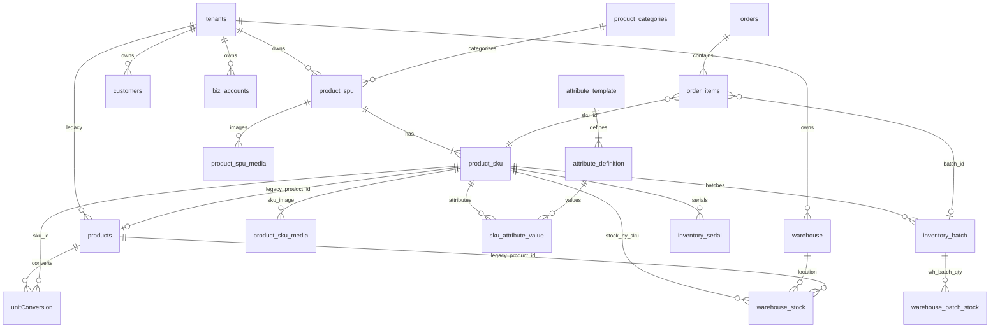

# TradeMind 综合重构与缺陷修复 — 设计方案

> 版本：2026-06-23  
> 范围：极速开单（`rapid-order.js`）、产品中心、工作台退货、租户注册初始化  
> 说明：项目中**不存在** `ui-speedy-order.js`，极速开单实现位于 `assets/js/rapid-order.js`。

---

## 0. 深度审计结论（根因摘要）

### 0.1 Q01 客户/仓库下拉为空

| 现象 | 根因 | 证据 |
|------|------|------|
| 客户下拉无数据 | `rapid-order.js` 读取 `customerMapCache` / `customersCache`，但 `dashboard.html` 的 `loadCustomerList()` 只写入 `customerLookupById` | `rapid-order.js:344` vs `dashboard.html:3158` |
| 仓库下拉无数据 | 请求路径错误：`/api/v1/rd/warehouses`，实际 API 为 `/api/v1/rd/products/warehouses` | `ProductController.java` `@GetMapping("/warehouses")` 挂载在 `/products` 下 |
| 新商户无默认数据 | 注册流程 `TenantProfileInitService.initOnRegister` 仅写 JSON 配置，**未**创建散客/门店/现金账户 | `TenantProfileInitService.java` |

### 0.2 Q02 选品缩略图不显示

| 环节 | 可能断点 |
|------|----------|
| 上传 | 新建产品 save 后才拿 `spuId` 上传封面；若 save 响应未解析 `spuId` 则 upload 跳过 |
| OSS | `ProductOssUploadService` 配置缺失时 upload 失败（需查 env） |
| 目录 API | `listSkuCatalog` 已 JOIN `product_spu_media`；若未上传则 `cover_url` 为 NULL |
| 前端 | `TM_ProductThumb` 依赖 `coverUrl`；OSS resize 参数需公网可读 URL |

### 0.3 Q03 弹窗溢出 / 关闭按钮不可见

- `#rapid-order-modal` 使用 `max-h-[92vh]` + 整体 `overflow-y-auto`，**未**采用 Header/Footer 固定 + Body 滚动
- 选品全屏 `#rapid-order-picker` 同样缺少 `100dvh` 约束

### 0.4 Q04 关闭开单后底栏消失

| 打开 | 关闭 |
|------|------|
| `TM_openUnifiedModal(modal)` → `TM_pushShellOverlay()` 隐藏 `#tm-app-tabbar` | 仅 `classList.add('hidden')` + `body.overflow=''`，**未**调用 `TM_closeUnifiedModal` |

**引用计数泄漏**：`__TM_shellOverlayDepth` 永不为 0 → 底栏永久 `tm-shell-chrome-hidden`。

涉及位置：`rapid-order.js` 关闭按钮、提交成功、`closePicker` 等。

### 0.5 Q05 移动端 SPU 视图无响应

- `product-center.html` 中 `#product-view-spu-btn` 带 `hidden md:inline-flex`，**手机端按钮不可见**
- `renderSpuDesktopTable` 行使用 `hidden md:table-row`，移动端无 SPU 卡片渲染

### 0.6 Q06 退货详情无法下钻

- `ui-returns.js` 的 `renderList` 仅渲染卡片 + 「验收」按钮，**无** `openDetail(returnId)` 与详情弹窗
- 非待验收状态条目完全不可点击

---

## 1. 产品域 E-R 关系（R07）



**设计要点**

- **Legacy 双轨**：`products`（旧）↔ `product_sku.legacy_product_id`；新能力以 SPU/SKU 为主路径。
- **图片归属（R09）**：
  - **SPU 层**：封面 `COVER` + 图册 `GALLERY`（最多 9 张）→ `product_spu_media`
  - **SKU 层**：规格差异图（如颜色款）→ `product_sku_media`
  - 列表/极速开单默认读 SPU 封面，SKU 图优先覆盖。
- **库存**：`warehouse_stock` 以 `(tenant_id, warehouse_id, sku_id, stock_type)` 为唯一键；`product_sku.stock` 为汇总缓存。

---

## 2. DDL 变更建议

### 2.1 租户注册默认数据（R01）— 无新表

使用现有表 INSERT（幂等）：

```sql
-- customers: 散客
-- warehouse: 门店
-- biz_accounts: 现金账户 (is_default_receive = true)
-- tenant_ops_profile.ui_profile 写入 defaultCustomerId / defaultWarehouseId / defaultAccountId
```

### 2.2 订单履约扩展（R03/R04）

```sql
ALTER TABLE orders ADD COLUMN IF NOT EXISTS logistics_provider VARCHAR(32);
ALTER TABLE orders ADD COLUMN IF NOT EXISTS logistics_tracking_no VARCHAR(64);

-- fulfillment_address_snapshot JSONB 已有，扩展约定：
-- LOGISTICS: { provider, trackingNo }
-- DELIVERY_VEHICLE: { vehiclePlate, driverName, driverPhone, shipFromAddress, ... }
```

### 2.3 行业迁移（R08）

```sql
UPDATE tenants
SET industry_vertical = 'CLOTHING',
    industry_selected_at = COALESCE(industry_selected_at, CURRENT_TIMESTAMP),
    update_time = CURRENT_TIMESTAMP
WHERE industry_vertical IS NULL
   OR industry_vertical IN ('PENDING', 'GENERAL');
-- 同步 tenant_ops_profile.product_capabilities（allowVariants=true）
```

### 2.4 多图（R09）

现有 `product_spu_media.media_type = 'GALLERY'` 已支持；建议：

```sql
-- 可选：限制每 SPU 图册数量（应用层校验 max 9）
CREATE INDEX IF NOT EXISTS idx_spu_media_gallery ON product_spu_media(spu_id, media_type);
```

---

## 3. 极速开单重构设计

### 3.1 数据加载契约（修复 Q01 + R01/R02）

**前端 `rapid-order.js`**

```javascript
// 客户：优先 customerLookupById，fallback 直调 CRM API
async function loadCustomersForRop() {
  if (window.customerLookupById && Object.keys(window.customerLookupById).length) {
    return window.customerLookupById;
  }
  const resp = await wrappedFetch('/api/v1/crm/customers');
  // 填充 rop-customer，默认选中 ui_profile.defaultCustomerId
}

// 仓库：修正路径
wrappedFetch('/api/v1/rd/products/warehouses')

// 账户（R02）
wrappedFetch('/api/v1/rd/accounts') // 或现有账户 API
// 默认 is_default_receive
```

**后端 `TenantBootstrapService`（新建，注册后调用）**

```
registerTenant()
  └─ tenantProfileInitService.initOnRegister()
  └─ tenantBootstrapService.seedDefaults(tenantId, userId)
        ├─ ensureCustomer("散客")
        ├─ ensureWarehouse("门店")
        ├─ ensureAccount("现金账户", defaultReceive=true)
        └─ merge ui_profile { defaultCustomerId, defaultWarehouseId, defaultAccountId }
```

### 3.2 发货方式动态表单（R03/R04）

| fulfillment_type | 动态字段 |
|------------------|----------|
| SELF_PICKUP | 无 |
| LOGISTICS | 物流商 select + 运单号 input + 扫码按钮（复用 `tm-serial-capture.js` / html5-qrcode） |
| DELIVERY_ADDRESS | 联系人/电话/地址（已有） |
| DELIVERY_VEHICLE | 车牌、司机姓名、司机电话、发货地址 |

提交写入 `orders.fulfillment_address_snapshot` + 新增 logistics 列。

### 3.3 选品级联（R05）

当前 `TM_SkuCatalogCache.filterByCategory(0)` 已返回全量；需确认：

- 左侧「全部」`categoryId=0` 默认选中
- 类目名从 `GET /api/v1/rd/products/categories` 补全，而非 `分类#id`

### 3.4 三段式弹窗 CSS（修复 Q03）

```html
<div id="rapid-order-modal" class="rop-modal-shell">
  <div class="rop-modal-panel">
    <header class="rop-modal-header shrink-0">标题 + 关闭</header>
    <main class="rop-modal-body flex-1 min-h-0 overflow-y-auto">表单 + 明细</main>
    <footer class="rop-modal-footer shrink-0">提交</footer>
  </div>
</div>
```

```css
.rop-modal-shell {
  position: fixed; inset: 0; z-index: 100;
  display: flex; align-items: flex-end;
  padding: 0;
}
.rop-modal-panel {
  width: 100%;
  max-height: min(100dvh, 100%);
  display: flex;
  flex-direction: column;
  border-radius: 1rem 1rem 0 0;
  background: #fff;
}
.rop-modal-header { padding-top: max(0.5rem, env(safe-area-inset-top)); }
.rop-modal-footer { padding-bottom: max(0.75rem, env(safe-area-inset-bottom)); }
.rop-modal-body { -webkit-overflow-scrolling: touch; overscroll-behavior: contain; }
```

选品页 `#rapid-order-picker` 同样：`header(返回/选好了) + body(类目+列表滚动) + fab(购物车)`。

### 3.5 底栏生命周期（修复 Q04）

**统一关闭函数**

```javascript
function closeRapidOrderModal() {
  var modal = document.getElementById('rapid-order-modal');
  if (typeof TM_closeUnifiedModal === 'function') {
    TM_closeUnifiedModal(modal);
  } else {
    modal.classList.add('hidden');
    document.body.style.overflow = '';
  }
  if (typeof TM_ensureShellOverlayVisible === 'function') {
    TM_ensureShellOverlayVisible();
  }
}
```

所有关闭路径（×、提交成功、Android 返回键）必须走此函数。

### 3.6 欠货模式（R06）

**现状**：`allowShortage=true` 时跳过 `validateStockForNewOrder`，走 `OrderFulfillmentService.applyShortageAllocation`。

**待补**

1. 前端：库存不足时 **Confirm 对话框**（当前 silent allowShortage）
2. 后端：欠货确认后 `warehouse_stock.stock` 允许扣减为负（或写 `shortage_qty` + 虚拟占用）
3. 列表展示：库存 < 0 显示「欠货 N」

```javascript
async function confirmShortageIfNeeded(lines, warehouseId) {
  var shortages = lines.filter(x => x.row.stock < x.qty);
  if (!shortages.length) return true;
  return TM_Confirm.show('以下商品库存不足，是否欠货开单？\n' + ...);
}
```

---

## 4. 产品中心重构设计

### 4.1 服饰笛卡尔积组品（R10）

**伪代码**

```
function generateSkuMatrix(spuId, attributeDefs, selectedValues):
  // selectedValues: { "颜色": ["红","蓝"], "尺码": ["M","L"] }
  combos = cartesianProduct(selectedValues)  // [{颜色:红,尺码:M}, ...]
  for combo in combos:
    skuCode = buildSkuCode(spuId, combo)
    skuId = upsertSku(spuId, skuCode, displayName(combo))
    for (attrName, value) in combo:
      upsertSkuAttributeValue(skuId, attrDefId(attrName), value)
    if initialStock provided:
      upsertWarehouseStock(skuId, warehouseId, qty)
  return skuIds
```

后端已有 `AttributeTemplateService.generateSkusFromMatrix`，前端需：

- 行业=CLOTHING 时强制展示 `#product-variant-matrix-panel`
- 属性行可增删；枚举值 tag 输入
- 预览 SKU 表格 + 每行初始库存

### 4.2 多图上传（R09）

- Input：`accept="image/*"` + `capture="environment"`（拍照）
- 图库：`multiple` + 最多 9 张
- 上传：`POST /products/media/upload` `mediaType=GALLERY`
- 首张可同时设 COVER

### 4.3 移动端 SPU 视图（Q05）

- 移除 `#product-view-spu-btn` 的 `hidden`，改为移动端可见
- 新增 `renderSpuMobileCards()` 或复用 `mobile-product-cards` 容器
- `toggleSpuListView` 切换时更新移动端 DOM

---

## 5. 工作台退货（Q06）

新增 `TM_Returns.openDetail(returnId)`：

- 弹窗三段式：主表信息 + 明细列表 + 操作（验收/关闭）
- 列表卡片 `onclick` 或「查看详情」按钮
- 待验收状态保留「验收」快捷入口

---

## 6. 实施阶段与文件清单

| 阶段 | 优先级 | 文件 | 内容 |
|------|--------|------|------|
| P0 | 紧急 | `rapid-order.js` | 数据源修复、TM_closeUnifiedModal、三段式布局 |
| P0 | 紧急 | `rapid-order.css` | modal shell 样式 |
| P0 | 紧急 | `ui-main.js` | 可选：rapid-order 注册到 TM_applyDialogShell |
| P1 | 高 | `TenantBootstrapService.java` | R01 默认数据 |
| P1 | 高 | `TenantService.registerTenant` | 调用 bootstrap |
| P1 | 高 | `rapid-order.js` | R02/R03/R04 账户与物流字段 |
| P1 | 高 | `OrderService` + DDL | logistics 字段持久化 |
| P2 | 中 | `ui-returns.js` | Q06 退货详情 |
| P2 | 中 | `product-center.html` + `ui-product-center.js` | Q05 SPU 移动视图 |
| P2 | 中 | `ui-product-center-enhance.js` | R09/R10 多图与矩阵 |
| P3 | 中 | 迁移脚本 | R08 行业→CLOTHING |
| P3 | 中 | `rapid-order.js` | R06 欠货确认 UI |

---

## 7. 无损修复约束

- **不修改** `ai-order-extract-parse.js`、语音提单链路
- **不修改** `wrappedFetch` / JWT 鉴权头注入逻辑
- 弹窗仍优先使用 `TM_openUnifiedModal` / `TM_closeUnifiedModal` 配对
- iframe 嵌入 dashboard 时，客户数据可通过 `window.parent.customerLookupById` 回退

---

## 8. 验收清单

- [ ] 新注册租户：散客/门店/现金账户自动存在，极速开单默认选中
- [ ] 客户/仓库/账户下拉均有数据
- [ ] 选品缩略图正常（新建产品上传封面后 catalog 有 cover_url）
- [ ] 移动端开单弹窗：Header 关闭按钮始终可见；中间区域可滚动
- [ ] 关闭开单后 `#tm-app-tabbar` 恢复显示
- [ ] 库存不足：弹确认 → 欠货开单 → 库存可为负
- [ ] 发物流：物流商+运单号（含扫码）写入订单
- [ ] 送车：车牌/司机/电话/地址写入 snapshot
- [ ] 手机端 SPU 视图可切换
- [ ] 退货单列表可打开详情
- [ ] 存量租户行业迁移为 CLOTHING
