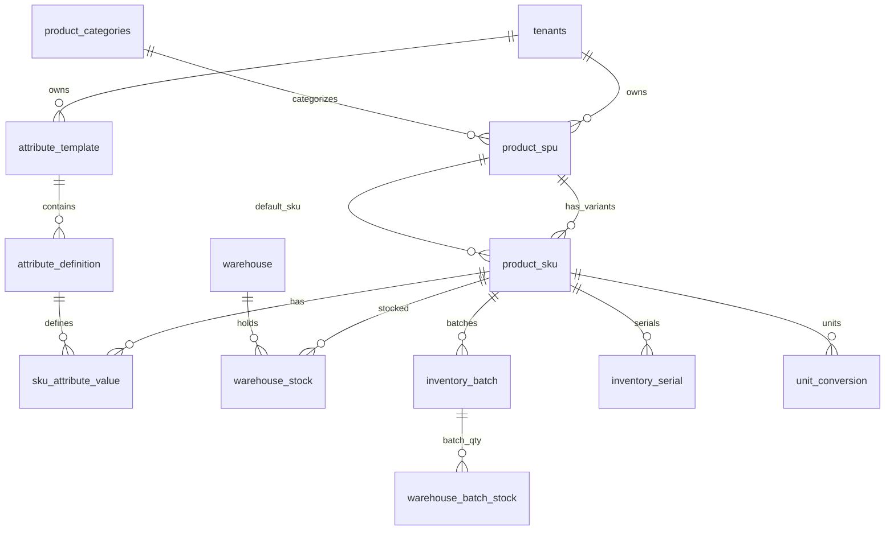

# 商贸智脑（TradeMind）产品信息扩展方案设计

| 属性 | 内容 |
|------|------|
| 文档版本 | v1.0 |
| 创建日期 | 2026-06-21 |
| 文档状态 | 方案设计（待评审） |
| 关联文档 | `spec.md`（系统概要设计）、`InitCfgService/db/schema-production.sql` |
| 适用范围 | 产品主数据、库存追踪、产品中心 UI、进货/销售单据联动 |

---

## 1. 概述

### 1.1 背景

当前 TradeMind 采用 **「一条 `products` 记录 = 一个可售 SKU」** 的扁平产品模型，适用于通用批发场景。随着 SaaS 多业态扩展，以下行业场景对产品有结构化扩展需求：

| 业态场景 | 典型需求 | 现状差距 |
|----------|----------|----------|
| 服装类 | 颜色、尺码等可自定义属性；属性模板；同款多规格 | 无结构化属性；多规格需建多条重复名称 product |
| 食品批发 | 生产日期、保质期；批次库存；临期预警与清货 | `purchase_items.batch_no` 仅文本存档，不参与库存扣减 |
| 3C 数码 | 一货一码；入库/出库绑定唯一序列号 | 全库无 serial / barcode 实体 |

本方案在 **不破坏现有通用批发用户体验** 的前提下，引入 SPU/SKU 分层、可选属性模板、批次效期、序列号追踪，并明确 UI 交互、库存记账、配额规则及全链路改动清单。

### 1.2 设计目标

1. **默认极简**：无属性商户的操作路径与当前产品中心一致（名称 + 售价 + 单位 + 库存）。
2. **能力渐进开启**：通过租户档案、商品分类推荐、用户主动启用，按需展示规格/效期/序列号能力。
3. **配置与作业分离**：建品定义能力与默认值；批次日期、扫码录入发生在进货/发货/调拨作业环节。
4. **配额按 SPU 计数**：用户理解的「商品数」对应 SPU，规格 SKU 不占用 `max_products` 配额。
5. **库存维度可堆叠**：SKU × 仓库 ×（可选批次）×（可选序列号），汇总层与明细层账实一致。
6. **兼容虚拟仓/实体仓**：扩展后的库存维度在 `InventoryFacade` 双分支中行为一致。

### 1.3 非目标（本阶段不做）

- GS1/EAN 条码生成与打印（可预留字段）。
- 完整 BOM / 组装拆件（工贸版另案）。
- 图片/多媒体资产管理（可后续挂 SPU）。
- 配额硬校验 AOP/Redis（沿用 spec 后续迭代项，本方案仅定义规则）。

---

## 2. 现状基线

### 2.1 数据模型（当前）

**权威 DDL**：`InitCfgService/src/main/resources/db/schema-production.sql`

```
tenants ──► products（扁平 SKU）
              ├── unitConversion（包装单位换算）
              ├── warehouse_stock（分仓库存：product_id × warehouse_id）
              └── product_categories（扁平分类）

purchases ──► purchase_items（含 batch_no 文本，不参与库存维度）
orders    ──► order_items（product_id + quantity，无批次/序列）
```

**`products` 核心字段**：`name, sku, category_id, price, stock, warning_stock, base_unit, purchase_unit, sales_unit, description, supplier_id`

**约束**：`sku` 租户内唯一（`uq_products_tenant_sku`）。

### 2.2 库存出入库（当前）

| 路径 | 服务 | 粒度 |
|------|------|------|
| 销售发货 | `OrderService` → `InventoryFacade` | `product_id` + 整数 `delta` |
| 进货入库 | `PurchaseService` → `/inventory/adjust` | 同上，采购单位经 `toBaseQuantity` 换算 |
| 手工调整 | `InventoryController` | `InventoryAdjustRequest.lines[{productId, delta}]` |
| 仓间调拨 | `ProductController.transfer` | 源仓减、目标仓加 |
| 产品编辑 | `ProductController.saveProduct` | `warehouseStocks` 覆盖写入 |

**虚拟仓判定**：`TenantOpsService.isVirtualInventory` — 无物理仓库时直接改 `products.stock`。

### 2.3 产品配置 UI（当前）

| 文件 | 职责 |
|------|------|
| `modules/fragments/product-registry-form.html` | 可复用建品表单片段 |
| `modules/product-center/product-overlays.html` | 产品中心弹窗 |
| `assets/js/ui-product-center.js` | 列表、CRUD、分类/仓库、调拨 |
| `assets/js/ui-product-center-enhance.js` | 校验、分仓联动、保存体组装 |
| `assets/js/tm-product-registry-form.js` | Onboarding / AI 审核复用 |

**表单结构**：基本信息（必填）+ 高级配置（折叠，选填）。

### 2.4 已有可复用能力

- **业态扩展**：`tenants.merchant_type`（D013）+ `/fragments/<业态>/` + `tm-ui-loader.js`
- **订阅配额**：`subscription_plans.quota_limits.max_products`
- **租户运营档案**：`tenant_ops_profile`（虚拟仓迁移等）
- **单据幂等**：`order_items.is_processed` / `purchase_items.is_processed`

---

## 3. 总体架构：三层分离 + 渐进开启

### 3.1 概念分层

```text
┌─ L1 商品主档层（SPU）────────────────────────────────────┐
│ 名称、分类、描述、默认供应商、行业能力开关                │
│ track_variants / track_expiry / track_serial              │
└──────────────────────────────────────────────────────────┘
         │
┌─ L2 规格属性层（可选）──────────────────────────────────┐
│ 属性模板 → 属性定义 → SKU 规格单品（属性值组合）          │
└──────────────────────────────────────────────────────────┘
         │
┌─ L3 库存追踪层（可选，作业驱动）────────────────────────┐
│ SKU × 仓库 × [批次：生产日期/到期日] × [序列号：单件码]   │
└──────────────────────────────────────────────────────────┘
```

### 3.2 核心实体关系（目标态）



### 3.3 与现有 `products` 表的演进策略

**推荐：渐进式表拆分（非大爆炸替换）**

| 阶段 | 策略 |
|------|------|
| 迁移期 | 保留 `products` 表；新增 `product_spu`；将现有 `products` 行视为 **默认 SKU**，通过 `spu_id` 关联 |
| 稳定期 | 交易明细 `product_id` 语义逐步迁移为 `sku_id`（或新增 `sku_id` 列，双写过渡） |
| 长期 | `products` 表退役或仅作兼容视图 |

**无属性商户**：1 SPU + 1 隐式 SKU，对外 API 可继续扁平化封装，前端无感知。

---

## 4. 业务场景方案

### 4.1 无属性产品（仅主商品 / SPU）

#### 4.1.1 规则

- 每个 SPU **必须** 至少关联 1 个 SKU（默认 SKU）。
- 用户未启用「多规格」时，**不展示** 规格相关 UI；保存时自动维护默认 SKU。
- 默认 SKU 的 `sku` 编码可自动生成（沿用现有 `SKU-{时间戳}` 逻辑）。
- **商品分类**（`product_categories`）仍为筛选与报表维度；与 SPU 主档绑定，不引入额外「主类别」实体。

#### 4.1.2 用户可见形态

与当前产品中心一致：名称、分类、售价、单位、库存总量。列表不显示「规格」列或展开箭头。

#### 4.1.3 升级为多规格

1. 用户在 SPU 上点击「添加规格」或启用规格能力卡片。
2. 原默认 SKU 可保留为矩阵中一个规格，或合并进新组合。
3. **配额不增加**（仍为 1 个 SPU）。

---

### 4.2 服装类 — 自定义属性与属性模板

#### 4.2.1 属性模板（租户级）

| 实体 | 说明 |
|------|------|
| `attribute_template` | 模板主档：名称、适用分类（可选）、是否系统预设 |
| `attribute_definition` | 属性项：名称（颜色/尺码）、类型（`ENUM`/`TEXT`/`NUMBER`）、枚举值 JSON、排序、是否参与 SKU 矩阵 |

**系统预设模板（种子数据）**：

- 服装标准：颜色（枚举）、尺码（枚举）
- 鞋类：颜色、鞋码
- 通用规格：规格（文本）

**分类默认绑定**：`product_categories.default_template_id`（可选），选分类后弱提示「本类商品通常有多规格」。

#### 4.2.2 建品流程（多规格）

1. 基本信息：名称、分类、默认售价（可作为 SKU 默认价）。
2. 规格能力卡片：选择模板 → 勾选属性值（如 红/黑 × S/M/L）→ 预览矩阵 → 批量生成 SKU。
3. 每个 SKU 可单独覆盖：售价、`warning_stock`、SKU 编码。
4. 库存建议在进货环节录入；建品时矩阵库存可为 0。

#### 4.2.3 属性模板管理入口

**产品中心 → 设置（齿轮）→ 属性模板**，非每次建品配置。支持增删改、从系统预设复制。

---

### 4.3 食品批发 — 保质期与批次库存

#### 4.3.1 SPU/SKU 级开关

| 字段 | 说明 |
|------|------|
| `track_expiry` | 是否管理保质期（挂 SPU 或 SKU，建议 SPU 级默认） |
| `default_shelf_life_days` | 默认保质期天数（如 180） |
| `expiry_policy` | 出库策略：`FEFO`（先到期先出）/ `FIFO`（先进先出） |

#### 4.3.2 批次主档与批次库存

| 实体 | 关键字段 |
|------|----------|
| `inventory_batch` | `batch_id`, `sku_id`, `batch_no`, `production_date`, `expiry_date`, `supplier_id`, `source_purchase_item_id` |
| `warehouse_batch_stock` | `sku_id`, `warehouse_id`, `batch_id`, `quantity` |

**与现有 `purchase_items.batch_no` 关系**：进货入库时创建/匹配 `inventory_batch`，`purchase_items` 增加 `batch_id` 外键；`batch_no` 保留为展示冗余。

#### 4.3.3 作业环节

- **建品**：仅开启开关 + 默认保质期天数；**不要求** 录入生产日期。
- **进货入库**：录入批次号、生产日期（到期日可自动 = 生产日期 + 默认天数）、数量、目标仓库。
- **销售发货**：按 `expiry_policy` 推荐批次；可选手动指定批次。
- **临期运营**：工作台预警、促销选品器「临期筛选」、可选自动促销规则（P4）。

---

### 4.4 3C 数码 — 一货一码（序列号）

#### 4.4.1 开关与实体

| 字段/实体 | 说明 |
|-----------|------|
| `track_serial` | 是否启用序列号管理（建议 SPU 级） |
| `serial_outbound_mode` | `STRICT`（强制扫码出库）/ `RELAXED`（先扣数量后补码，不推荐 3C） |
| `inventory_serial` | `serial_no`, `sku_id`, `warehouse_id`, `batch_id`（可选）, `status`, `source_type`, `source_id` |

**状态枚举**：`IN_STOCK` / `ALLOCATED` / `SHIPPED` / `RETURNED` / `SCRAPPED`

#### 4.4.2 数量一致性

- SKU × 仓库在库数量 = 该维度下 `status = IN_STOCK` 的 serial 记录数。
- 与 `warehouse_stock` 汇总层强校验；启用序列号后禁止仅改汇总而不绑码（`STRICT` 模式）。

#### 4.4.3 作业环节

- **建品**：仅开启开关；不录入具体序列号。
- **进货入库**：扫码或批量粘贴录入 N 个码。
- **销售发货**：扫码出库或从在库列表勾选；未扫够不允许发货（`STRICT`）。
- **调拨**：码随仓迁移，更新 `warehouse_id`。
- **溯源**：按 `serial_no` 查询出入库履历（`inventory_movement_serial`）。

#### 4.4.4 与批次的关系

效期与序列号 **正交、独立开关**。可同时启用（如手机有序列号也有批次）；食品通常仅批次。组合模式见 §6.4。

---

## 5. 配额与计数规则

### 5.1 `max_products` 语义变更

| 对象 | 是否计入 `quota_limits.max_products` |
|------|--------------------------------------|
| SPU（主商品） | ✅ 计入 |
| SKU（规格单品） | ❌ 不计入 |
| 批次 | ❌ 不计入 |
| 序列号 | ❌ 不计入 |

**文档与 UI 统一用语**：「商品」= SPU。保留 JSON 键名 `max_products` 以兼容存量配置，在 `spec.md` §1.5.3 补充语义说明。

### 5.2 可选 Enterprise 限制

`quota_limits.max_skus_per_spu`（可选）：防止单 SPU 滥用生成上万 SKU。默认不限制或高档位放宽。

### 5.3 校验时机

| 操作 | 校验 |
|------|------|
| 创建 SPU | 检查 `spu_count < max_products` |
| 批量生成 SKU | 仅检查 `max_skus_per_spu`（若配置） |
| 删除 SPU | 级联删除 SKU、批次、序列号（或软删，需评审） |

### 5.4 用户提示文案

- 列表：`已创建 85 / 100 个商品`
- 添加规格：`当前商品已有 8 个规格，不占用商品数量配额`
- 接近上限：引导删除 SPU，而非删除某个尺码

---

## 6. 库存维度模型与一致性

### 6.1 维度堆叠

```text
SPU（不直接记账）
  └── SKU（属性组合，可售单品）
        └── 仓库（warehouse_id）
              └── [可选] 批次（batch_id：生产日期、到期日）
                    └── [可选] 序列号（serial_no：单件）
```

### 6.2 记账表职责

| 表 | 粒度 | 何时存在 |
|----|------|----------|
| `warehouse_stock` | `sku_id × warehouse_id → quantity` | **始终**（汇总层） |
| `warehouse_batch_stock` | `sku_id × warehouse_id × batch_id → quantity` | `track_expiry = true` |
| `inventory_serial` | 每条 serial 一条记录 | `track_serial = true` |

### 6.3 一致性约束

1. `warehouse_stock.quantity` = Σ 同 SKU×仓 下各 `warehouse_batch_stock`（若启用批次）。
2. `warehouse_stock.quantity` = 同 SKU×仓 下 `IN_STOCK` serial 数量（若启用序列号）。
3. SPU 展示总库存 = Σ 其下所有 SKU 库存。
4. `products.stock`（迁移期）= SPU 总库存或默认 SKU 库存，由 `InventoryFacade` 回写，避免双源真相。

### 6.4 能力组合矩阵

| track_variants | track_expiry | track_serial | 典型业态 | 出库逻辑 |
|----------------|--------------|--------------|----------|----------|
| false | false | false | 通用批发 | 数量扣减 |
| true | false | false | 服装 | SKU 数量扣减 |
| false | true | false | 食品 | 批次数量 + FEFO/FIFO |
| false | false | true | 3C 配件（无批次） | 序列号绑定 |
| true | true | false | 食品多规格 | SKU + 批次 |
| true | false | true | 数码多规格 | SKU + 序列号 |
| true | true | true | 手机等 | 批次 + 序列号，FEFO 后扫码 |

### 6.5 虚拟仓兼容

无物理仓库时，逻辑等价于「默认虚拟仓 ID」。批次与序列号仍可用；`InventoryFacade` 虚拟分支须同步支持新维度，避免 onboarding 租户（常无仓库）行为不一致。

---

## 7. 库存展示与跟进（多属性 × 多仓库）

### 7.1 三视角展示

#### 视角 A：商品视角（产品中心默认 — 老板/销售）

```text
▼ 东北大板原味（SPU）          总库存 1,200    3 个规格
    ├ 原味·箱装（SKU）           800
    │   ├ 上海仓 500  [批次 3]   ← 效期开启可展开
    │   └ 北京仓 300
    ├ 草莓·箱装（SKU）           400
```

- 列表：SPU 行 + 规格数徽章 + 总库存。
- 无属性：单行，无展开箭头。

#### 视角 B：规格矩阵（服装 — 建品/补货）

| 颜色 | S | M | L | 合计 |
|------|---|---|---|------|
| 红 | 12 | 8 | 3 | 23 |
| 黑 | 10 | 15 | 6 | 31 |

- 仓库筛选器：「全部 / 上海仓 / 北京仓」切换矩阵数据。
- 点击单元格 → 弹出该 SKU 各仓分布。
- 移动端：「选属性 → 看库存」两步，避免小屏矩阵难用。

#### 视角 C：仓库视角（仓管 — 入库/调拨）

```text
上海仓
  ├ 东北大板·原味·箱装    500  [临期 2 批 80 件]
  ├ T恤·红·M              23
  └ iPhone15·128G黑       5  [序列号管理]
```

入口：仓库管理 / 库存作业台。

### 7.2 预警展示层次

| 预警 | 挂载层级 | 展示 |
|------|----------|------|
| 低库存 | SKU vs `warning_stock` | SPU 行角标「2 个规格偏低」 |
| 临期 | 批次 `expiry_date` | SPU/SKU 行「临期 80 件」 |
| 缺码 | 发货单 | 作业台提示 |

工作台卡片按 **SPU 聚合**，点进看 SKU/批次明细。

### 7.3 建品弹窗中的库存字段规则

| 有无规格 | 基本信息「库存总量」 | 高级配置「各仓库库存」 |
|----------|----------------------|------------------------|
| 无规格 | 可编辑（与现网一致） | 分仓输入，汇总回总量 |
| 有规格 | **只读合计**，文案「各规格库存合计 54」 | **只读汇总** 或链至规格矩阵 |
| 有效期 | 总量旁徽章「含临期 12 件」 | 不展示批次明细 |
| 序列号 | 总量 = 在库码数 | 链接「查看序列号列表」 |

**原则**：建品表单不做 SKU×仓×批次 的明细录入；变动发生在进货/发货/调拨。

### 7.4 各作业环节库存录入矩阵

| 环节 | 无属性 | 多规格 | 多仓 | 效期 | 序列号 |
|------|--------|--------|------|------|--------|
| 建品 | 可填总库存 | 矩阵预览，建议库存 0 | 高级填各仓或入库补 | 只设默认天数 | 只开开关 |
| 进货入库 | 数量 | 选 SKU | 选目标仓 | 批次+生产日期 | 扫码录入 |
| 销售发货 | 扣数量 | 订单行带 SKU | 扣指定仓 | 选批次/FEFO | 扫码出库 |
| 调拨 | 数量 | 指定 SKU | 源仓→目标仓 | 可选批次 | 扫码迁移 |
| 手工调整 | delta | 指定 SKU | 指定仓 | 指定批次 | 指定 serial |

---

## 8. 产品配置 UI 设计

### 8.1 整体布局：三层结构

```text
┌─ 基本信息（始终可见）──────────────────────────────────┐
│ 商品名称*、商品分类、默认售价*、基本单位*、库存总量     │
└────────────────────────────────────────────────────────┘
┌─ 能力卡片区（按开关动态出现，默认折叠）────────────────┐
│  [规格与属性]  [保质期管理]  [序列号管理]               │
│  每张卡片：图标 + 一行摘要 + 展开编辑区                   │
└────────────────────────────────────────────────────────┘
┌─ 高级配置（保持现有折叠）──────────────────────────────┐
│ 默认 SKU 编码、供应商、入/出库单位、预警库存、           │
│ 各仓库库存汇总、产品描述                                 │
└────────────────────────────────────────────────────────┘
```

### 8.2 不推荐方案

| 方案 | 问题 |
|------|------|
| 全部塞进「高级配置」 | 能力全开时字段爆炸 |
| 全部平铺在基本信息下 | 无属性用户也被干扰 |
| 按业态三套完全不同表单 | 维护成本高，跨业态无法组合 |

### 8.3 能力卡片明细

#### 卡片 A：规格与属性

| 状态 | 展示 |
|------|------|
| 折叠摘要 | `未启用规格` 或 `3 个规格：红S、红M、黑L` |
| 展开 | 选模板 → 勾选属性值 → 预览矩阵 → 批量生成 SKU |
| 首次入口 | 基本信息区轻链「这款有多种规格？」 |

#### 卡片 B：保质期管理

| 状态 | 展示 |
|------|------|
| 折叠摘要 | `未启用` 或 `默认保质期 180 天 · 按批次管理` |
| 展开 | 开关、`default_shelf_life_days`、出库策略 FEFO/FIFO |

#### 卡片 C：序列号管理

| 状态 | 展示 |
|------|------|
| 折叠摘要 | `未启用` 或 `已启用 · 入库/出库需扫码` |
| 展开 | 开关、`serial_outbound_mode`、码格式提示（可选） |

### 8.4 能力卡片显隐逻辑

| 条件 | 规格卡片 | 效期卡片 | 序列号卡片 |
|------|----------|----------|------------|
| 租户档案未开启 | 隐藏 | 隐藏 | 隐藏 |
| 租户档案已开启 | 显示（折叠） | 显示（折叠） | 显示（折叠） |
| 分类有默认推荐 | 显示 + 弱提示 | 同上 | 同上 |
| 用户点击「添加规格」等 | 强制显示对应卡片 | — | — |

**租户档案**写入 `tenant_ops_profile` 扩展 JSON 或独立字段：

```json
{
  "productCapabilities": {
    "allowVariants": true,
    "allowExpiry": true,
    "allowSerial": false
  }
}
```

Onboarding 轻量问卷一次性配置；与 `merchant_type`（D013）默认推荐联动。

### 8.5 高级配置与能力卡片分工

| 区域 | 放置内容 | 不放置 |
|------|----------|--------|
| 基本信息 | 名称、分类、价、单位、库存总览 | 属性枚举、批次、序列号列表 |
| 能力卡片 | 行业能力 **定义与开关** | 具体入库批次、扫码记录 |
| 高级配置 | SKU 编码、供应商、单位换算、分仓汇总、描述 | 规格矩阵（归卡片 A） |

### 8.6 移动端

能力卡片适配 Bottom Sheet（沿用 `tm-layout-engine.css`）：摘要一行 → 点开整卡编辑。

### 8.7 各页面可编辑性总表（附录 A）

见文档末尾 **附录 A**。

---

## 9. 数据库设计（目标态草案）

**执行约束**：DDL 仅通过 `InitCfgService` 幂等 `ALTER` / 新表脚本发布；业务微服务 `ddl-auto: none`。

### 9.1 新增表

#### `product_spu`

| 字段 | 类型 | 说明 |
|------|------|------|
| spu_id | SERIAL PK | |
| tenant_id | VARCHAR(32) FK | |
| name | VARCHAR(100) | 商品名称 |
| category_id | INT FK | 商品分类 |
| description | TEXT | |
| default_supplier_id | INT FK | 默认供应商 |
| track_variants | BOOLEAN DEFAULT FALSE | |
| track_expiry | BOOLEAN DEFAULT FALSE | |
| track_serial | BOOLEAN DEFAULT FALSE | |
| default_shelf_life_days | INT | 可空 |
| expiry_policy | VARCHAR(16) | FEFO/FIFO |
| serial_outbound_mode | VARCHAR(16) | STRICT/RELAXED |
| status | VARCHAR(20) | ACTIVE/ARCHIVED |
| create_time / update_time | TIMESTAMP | |

**索引**：`(tenant_id)`, `(tenant_id, category_id)`

#### `product_sku`

| 字段 | 类型 | 说明 |
|------|------|------|
| sku_id | SERIAL PK | |
| tenant_id | VARCHAR(32) FK | |
| spu_id | INT FK → product_spu | |
| sku_code | VARCHAR(50) | 租户内唯一 |
| name | VARCHAR(100) | 可空，默认继承 SPU 名 + 规格摘要 |
| price | DECIMAL(10,2) | |
| warning_stock | INT | |
| base_unit / purchase_unit / sales_unit | VARCHAR(20) | |
| stock | INT | 汇总库存（回写） |
| is_default | BOOLEAN | 默认 SKU（无规格时唯一 true） |
| legacy_product_id | INT | 迁移期关联原 `products.product_id` |
| create_time / update_time | TIMESTAMP | |

**唯一约束**：`UNIQUE(tenant_id, sku_code)`

#### `attribute_template` / `attribute_definition`

模板与属性项；`attribute_definition.attr_type`：`ENUM`/`TEXT`/`NUMBER`；`enum_values JSONB`。

#### `sku_attribute_value`

`(sku_id, attr_def_id, value_text)`；ENUM 类型存选中枚举值。

#### `inventory_batch`

| 字段 | 说明 |
|------|------|
| batch_id PK | |
| tenant_id, sku_id | |
| batch_no | |
| production_date, expiry_date | |
| supplier_id | 可空 |

#### `warehouse_batch_stock`

`(sku_id, warehouse_id, batch_id, quantity)`

#### `inventory_serial`

| 字段 | 说明 |
|------|------|
| serial_id PK | |
| tenant_id, sku_id, warehouse_id | |
| batch_id | 可空 |
| serial_no | 租户内唯一 |
| status | IN_STOCK/... |
| source_type, source_id | 来源单据 |

#### `inventory_movement_serial`

`(movement_id, serial_id)` 出入库与码关联。

### 9.2 改造现有表

| 表 | 变更 |
|----|------|
| `warehouse_stock` | `product_id` → `sku_id`（迁移期双列） |
| `unitConversion` | `product_id` → `sku_id` |
| `order_items` | 增加 `sku_id`, `batch_id`；可选 `serial_refs` JSONB |
| `purchase_items` | 增加 `sku_id`, `batch_id`, `production_date`, `expiry_date` |
| `production` | `product_id` → `sku_id`（后续） |
| `product_categories` | `default_template_id`, `suggest_track_expiry`, `suggest_track_serial` |

### 9.3 迁移脚本要点

1. 为每条 `products` 创建 `product_spu` + 默认 `product_sku`，`legacy_product_id` 回填。
2. `warehouse_stock.product_id` 映射到对应 `sku_id`。
3. `purchase_items.batch_no` 非空行尝试生成 `inventory_batch`（可选 P1 后执行）。
4. 配额计数改为 `COUNT(product_spu WHERE tenant_id = ?)`。

---

## 10. API 设计（草案）

### 10.1 产品主数据

| 方法 | 路径 | 说明 |
|------|------|------|
| GET | `/api/v1/rd/products/spu` | SPU 列表（分页、分类筛选） |
| GET | `/api/v1/rd/products/spu/{spuId}` | SPU 详情 + SKUs + 能力开关 |
| POST | `/api/v1/rd/products/spu/save` | 保存 SPU + 能力开关 |
| POST | `/api/v1/rd/products/sku/batch-generate` | 按属性矩阵批量生成 SKU |
| GET/POST/DELETE | `/api/v1/rd/products/attribute-templates` | 属性模板 CRUD |

**兼容期**：保留 `GET/POST /api/v1/rd/products/*` 扁平 API，内部转 SPU/SKU。

### 10.2 保存体 `ProductSpuSaveDTO`（替代 `ProductWithUnitsDTO` 演进）

```json
{
  "spu": {
    "spuId": null,
    "name": "纯棉T恤",
    "categoryId": 1,
    "trackVariants": true,
    "trackExpiry": false,
    "trackSerial": false,
    "defaultShelfLifeDays": null,
    "expiryPolicy": null
  },
  "skus": [
    {
      "skuId": null,
      "skuCode": "SKU-001",
      "price": 99.00,
      "warningStock": 5,
      "attributes": { "颜色": "红", "尺码": "M" },
      "unitConversions": [],
      "warehouseStocks": [{ "warehouseId": 1, "quantity": 10 }]
    }
  ],
  "variantMatrix": {
    "templateId": 1,
    "selectedValues": { "颜色": ["红","黑"], "尺码": ["S","M","L"] }
  }
}
```

### 10.3 库存调整 `InventoryAdjustRequest` 扩展

```json
{
  "warehouseId": 1,
  "sourceType": "PURCHASE_INBOUND",
  "sourceId": "123",
  "idempotencyKey": "...",
  "lines": [
    {
      "skuId": 42,
      "delta": 10,
      "batchId": 7,
      "batchInfo": {
        "batchNo": "B20260601",
        "productionDate": "2026-06-01",
        "expiryDate": "2026-12-01"
      },
      "serialNos": ["SN001", "SN002"]
    }
  ]
}
```

### 10.4 库存查询

| 方法 | 路径 | 说明 |
|------|------|------|
| GET | `/api/v1/rd/inventory/sku/{skuId}/warehouses` | 分仓库存 |
| GET | `/api/v1/rd/inventory/sku/{skuId}/batches` | 批次明细 |
| GET | `/api/v1/rd/inventory/serials` | 序列号列表（筛选 sku/仓/状态） |
| GET | `/api/v1/rd/inventory/spu/{spuId}/matrix` | 规格矩阵库存（支持 warehouseId 筛选） |
| GET | `/api/v1/rd/inventory/alerts/expiry` | 临期预警列表 |

---

## 11. 后端服务改动清单

### 11.1 RDService

| 模块 | 改动 |
|------|------|
| `ProductController` / `ProductService` | SPU/SKU CRUD、模板 CRUD、配额按 SPU 校验 |
| `ProductWithUnitsDTO` | 演进为 `ProductSpuSaveDTO`；兼容适配层 |
| `InventoryFacade` / `InventoryService` | 批次 delta、序列号列表、双分支（虚拟/实体） |
| `InventoryController` | 扩展 `InventoryAdjustRequest` |
| `OrderService` | 发货扣 SKU×仓×批次/序列；FEFO 推荐 |
| `ProductController.transfer` | 调拨携带批次/序列号 |
| `RoleAwareProductMapper` | 新字段脱敏 |
| `ProductCostService` | 溯源改 `sku_id` |

### 11.2 SuppService

| 模块 | 改动 |
|------|------|
| `PurchaseService` | 入库创建 batch、录入 serial、写 `batch_id` |
| `PurchaseItem` 实体 | 新字段 |

### 11.3 TenantService

| 模块 | 改动 |
|------|------|
| `TenantOpsService` / profile | `productCapabilities` 读写 |
| Onboarding API | 问卷结果写入档案 |

### 11.4 AIService

| 模块 | 改动 |
|------|------|
| AI 建品 / 订单提取 Schema | 识别规格维度、批次、序列号建议 |
| `ai-order-extract-parse.js` 协同 | 前端解析 |

### 11.5 InitCfgService

| 模块 | 改动 |
|------|------|
| `schema-production.sql` / 增量脚本 | 新表与 ALTER |
| `seed-data.sql` | 系统属性模板种子 |
| `validateCoreSchema()` | 校验新表/列 |

### 11.6 网关

无路径变更；JWT / `X-Merchant-Type` 透传沿用。

---

## 12. 前端改动清单

### 12.1 产品中心

| 文件 | 改动 |
|------|------|
| `product-registry-form.html` | 能力卡片区 HTML 结构 |
| `product-overlays.html` | 同步弹窗结构 |
| `ui-product-center.js` | SPU 树形列表、模板管理、矩阵视图入口 |
| `ui-product-center-enhance.js` | 保存体组装、能力显隐、配额提示 |
| `tm-product-registry-form.js` | Onboarding 双 ID 适配 |
| `product-center.css` | 卡片、矩阵样式 |

### 12.2 供应链 / 进货

| 文件 | 改动 |
|------|------|
| `ui-supplier.js` | 批次日期、SKU 选择、扫码 serial |
| `supply-chain.html` | 进货行扩展列 |

### 12.3 销售 / 订单

| 文件 | 改动 |
|------|------|
| `order-workbench-modal.js` | 发货选批次、扫序列号 |
| 订单行组件 | `skuId`, `batchId` 展示 |

### 12.4 工作台 / 促销

| 文件 | 改动 |
|------|------|
| `dashboard-workbench.js` | 临期预警卡片 |
| `index-app.html` promo picker | 临期筛选 |
| `dashboard-workbench.js` | 快捷建品走新 save API |

### 12.5 业态片段

| 路径 | 改动 |
|------|------|
| `/fragments/<业态>/` | 行业默认能力与 onboarding 提示文案 |

### 12.6 权限

`ui-permissions.js` / `ui-role-engine.js`：序列号溯源、模板管理权限码（若需要）。

---

## 13. 分期实施计划

| 阶段 | 范围 | 用户价值 | 风险 |
|------|------|----------|------|
| **P0** | 租户档案 + SPU/SKU 表迁移 + 无属性兼容 API | 架构底座；用户无感 | 中（数据迁移） |
| **P1** | 批次库存 + 进货写批次 + 临期预警 | 食品批发核心 | 中（InventoryFacade） |
| **P2** | 属性模板 + 规格矩阵 + 批量 SKU | 服装核心 | 中高 |
| **P3** | 序列号全链路 + STRICT 出库 | 3C 核心 | 高 |
| **P4** | 临期自动促销、FEFO 智能推荐、AI 识规格 | 运营自动化 | 中 |

**推荐顺序**：P0 → P1 → P2 → P3 → P4。

每个阶段须完成：迁移脚本、虚拟仓回归、onboarding 回归、配额计数验证。

---

## 14. 待评审架构决策

| # | 议题 | 选项 | 建议 |
|---|------|------|------|
| 1 | 配额键名 | 保留 `max_products` vs 新增 `max_spu` | 保留键名，文档明确语义 |
| 2 | 历史同款合并 | 是否提供「多 product 合并为 1 SPU」工具 | P2 后提供运维/商户工具 |
| 3 | 虚拟仓 + 批次/序列号 | 是否允许 | 允许，逻辑默认仓 |
| 4 | 序列号出库 | STRICT vs RELAXED 默认 | 3C 默认 STRICT |
| 5 | SPU 软删 | 软删 vs 硬删级联 | 软删 + 禁止有库存时删 |
| 6 | `order_items.product_id` | 双写过渡期长度 | 至少跨 2 个发布周期 |
| 7 | 图片挂 SPU | P0 还是后续 | 后续 P2 与规格矩阵一并 |

---

## 15. 测试要点

### 15.1 功能测试

- 无属性商户：全流程与现网行为一致。
- 多规格：矩阵生成、单 SKU 改价、列表展开。
- 多仓 + 多规格：矩阵按仓筛选、调拨、汇总一致。
- 批次：进货创建批次、FEFO 出库、临期预警阈值。
- 序列号：扫码入库数 = 在库数；STRICT 发货拦截。
- 配额：建 SPU 超限拒绝；加规格不超限。
- 虚拟仓：上述场景在无仓库租户复测。

### 15.2 回归测试

- AI 建品 / Onboarding 审核确认。
- 销售发货幂等（`is_processed`）。
- 进货分批入库（`processed_qty`）。
- 角色脱敏售价字段。

### 15.3 性能

- SPU 列表分页（SKU 懒加载）。
- 序列号扫码批量入库（单次 500 码）。
- 临期预警查询索引（`expiry_date`）。

---

## 16. 文档与 spec 同步项

本方案落地后须更新 `spec.md`：

- §1.1.x 新增表结构章节（`product_spu`, `product_sku`, 等）。
- §1.5.3 `max_products` 语义改为 SPU 计数。
- §1.3.x 订单/进货明细新字段。
- §3.1 产品中心 UI 与能力卡片描述。
- §2.x InventoryFacade 批次/序列号分支。
- 版本历史新增 v1.xx 条目。

---

## 附录 A：各页面字段可编辑性矩阵

| 页面/区域 | 无属性 | 多规格 | 多仓 | 效期 | 序列号 |
|-----------|--------|--------|------|------|--------|
| 建品-基本信息-库存总量 | 可编辑 | 只读合计 | 只读/汇总 | 徽章 | 只读=码数 |
| 建品-高级-各仓库存 | 可编辑 | 只读/跳转矩阵 | 可编辑（无规格） | 不展示批次 | 链接列表 |
| 建品-卡片A 规格 | 隐藏 | 可编辑 | — | — | — |
| 建品-卡片B 效期 | 隐藏 | 开关+默认天数 | — | — | — |
| 建品-卡片C 序列号 | 隐藏 | 开关 | — | — | — |
| 进货入库 | 数量 | 选 SKU | 选仓 | 批次+日期 | 扫码 |
| 销售发货 | 数量 | 行内 SKU | 选仓 | 选批次 | 扫码 |
| 调拨 | 数量 | 选 SKU | 源/目标仓 | 可选批次 | 扫码 |
| 产品列表 | SPU 行 | 可展开 SKU | 仓分布 | 临期角标 | 角标 |
| 仓库视角 | SKU 行 | SKU 行 | 主视角 | 批次展开 | 码列表 |

---

## 附录 B：能力开关与租户/分类联动

| merchant_type (D013) | 档案默认 allowVariants | allowExpiry | allowSerial |
|----------------------|------------------------|-------------|-------------|
| WHOLESALE | false | true（弱） | false |
| ECOM | true（弱） | false | false |
| FOREIGN_TRADE | false | false | false |
| FACTORY_TRADE | false | false | false |

「弱」= Onboarding 推荐，用户可拒绝。服装/3C 垂直包可在注册意图参数扩展后覆盖默认。

---

## 附录 C：关键文件路径速查

### 数据库
- `InitCfgService/src/main/resources/db/schema-production.sql`
- `InitCfgService/src/main/resources/db/seed-data.sql`

### 后端
- `RDService/.../controller/ProductController.java`
- `RDService/.../controller/InventoryController.java`
- `RDService/.../service/InventoryFacade.java`
- `RDService/.../service/OrderService.java`
- `SuppService/.../service/PurchaseService.java`

### 前端
- `TradeMind-Web/modules/fragments/product-registry-form.html`
- `TradeMind-Web/assets/js/ui-product-center.js`
- `TradeMind-Web/assets/js/ui-product-center-enhance.js`
- `TradeMind-Web/assets/js/tm-product-registry-form.js`
- `TradeMind-Web/assets/js/ui-supplier.js`
- `TradeMind-Web/assets/js/dashboard-workbench.js`

---

*文档结束*
