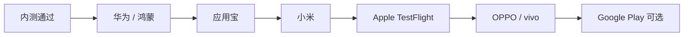

# TradeMind 各应用市场上架字段对照表

> **文档版本**：v1.0  
> **适用产品**：TradeMind 商贸智脑  
> **运营主体**：杭州巨猿科技有限公司  
> **服务域名**：`trademind.com.cn`  
> **关联文档**：`spec.md`、`APP备案材料填写模板.md`  
> **说明**：各平台字段名、审核周期以商店当期规则为准；本文按 **2026 年国内主流市场 + App Store + Google Play** 整理 TradeMind 填表对照。包名等待填项与备案文档保持一致。

---

## 1. 使用说明

### 1.1 图例

| 符号 | 含义 |
|------|------|
| **必填** | 无此项无法提交审核 |
| **选填** | 可不填，但建议填写利于展示与审核 |
| **条件** | 特定功能或地区才需要 |
| **TM** | TradeMind 推荐统一填写值（复制用） |

### 1.2 上架总顺序建议



### 1.3 全平台通用素材规格

| 素材 | 规格 | TM 内容建议 |
|------|------|-------------|
| 应用图标 | 512×512 PNG，无透明圆角（商店会裁圆） | 品牌 Teal `#14B8A6` + TradeMind 标识 |
| 应用名称 | 各平台长度限制不同 | TradeMind 商贸智脑 |
| 副标题 / 一句话 | 见各平台 | 智能经营一体化平台 |
| 隐私政策 URL | HTTPS 必填 | `https://trademind.com.cn/privacy.html` |
| 用户协议 URL | 多数国内必填 | `https://trademind.com.cn/terms.html` |
| 官网 | 选填 | `https://trademind.com.cn` |
| 客服电话 / 邮箱 | 国内多必填 | 【待填】 |
| 测试账号 | 审核常需 | 见 §8 |

---

## 2. 全平台核心字段主数据（MDM）

**建议在提审前维护一张主数据表，各市场复制粘贴，避免名称不一致导致审核质疑。**

| 字段键 | TM 统一值 | 备注 |
|--------|-----------|------|
| `app_name_cn` | TradeMind 商贸智脑 | 主展示名 |
| `app_name_en` | TradeMind | 国际商店 |
| `subtitle` | 智能经营一体化平台 | |
| `package_android` | 【待填，如 com.juyuan.trademind】 | 与备案一致 |
| `bundle_ios` | 【与 Android 包名建议一致】 | |
| `bundle_harmony` | 【与 Android 包名建议一致】 | |
| `version_first` | 1.0.0 | |
| `company_name` | 杭州巨猿科技有限公司 | |
| `icp_number` | 浙ICP备2026010267号-1 | |
| `psb_number` | 浙公网安备33010802014468号 | |
| `app_beian_number` | 【备案通过后填写】 | APP 备案号 |
| `soft_copyright_no` | 【软著登记号】 | |
| `category_primary` | 商务 / 效率办公 | 各平台映射见下 |
| `age_rating` | 12+ 或 企业应用 | 无社交 UGC |
| `payment_in_app` | 会员订阅（杭州银行收银台） | 审核说明用 |

---

## 3. Apple App Store（iOS）

**入口**：App Store Connect → My Apps  
**包格式**：IPA（通过 Xcode / Transporter 上传）  
**典型审核周期**：1~3 个工作日（首次 / 支付相关可能 5~7 天）

### 3.1 App 信息（App Information）

| 字段（ASC 界面） | 必填 | 长度/格式 | TM 填写值 |
|------------------|------|-----------|-----------|
| Name | **必填** | ≤30 字符 | TradeMind 商贸智脑 |
| Subtitle | 选填 | ≤30 字符 | 智能经营一体化平台 |
| Bundle ID | **必填** | 预创建 | 【bundle_ios 待填】 |
| SKU | **必填** | 内部标识 | trademind-ios-001 |
| Primary Language | **必填** | — | 简体中文 |
| Category (Primary) | **必填** | — | Business（商务） |
| Category (Secondary) | 选填 | — | Productivity（效率） |
| Content Rights | **必填** | — | 不包含第三方内容或已获授权 |
| Age Rating | **必填** | 问卷 | 完成分级问卷（通常 4+ / 12+，无暴力赌博） |

### 3.2 定价与销售范围（Pricing and Availability）

| 字段 | 必填 | TM 填写值 |
|------|------|-----------|
| Price | **必填** | Free（免费下载） |
| Availability | **必填** | 中国大陆（可按需扩展） |
| Pre-Order | 选填 | 否 |

### 3.3 版本信息（Version Information）

| 字段 | 必填 | TM 填写值 |
|------|------|-----------|
| Version | **必填** | 1.0.0 |
| Copyright | **必填** | © 2026 杭州巨猿科技有限公司 |
| Description | **必填** | 见 §7.1 长描述 |
| Keywords | **必填** | 商贸,ERP,订单,库存,CRM,批发,进销存,智能录单 |
| Support URL | **必填** | `https://trademind.com.cn` 或帮助页 |
| Marketing URL | 选填 | `https://trademind.com.cn` |
| Privacy Policy URL | **必填** | `https://trademind.com.cn/privacy.html` |
| What's New | **必填** | 首版：TradeMind 商贸智脑正式上线，支持订单、客户、产品与智能录单。 |

### 3.4 截图与预览（必填至少一组）

| 设备尺寸 | 必填 | 规格 | 数量 |
|----------|------|------|------|
| iPhone 6.7" | **必填** | 1290×2796 或 2796×1290 | 3~10 张 |
| iPhone 6.5" | 条件 | 1284×2778 等 | 若无 6.7 可替代 |
| iPhone 5.5" | 条件 | 1242×2208 | 部分情况需要 |
| iPad Pro | 条件 | 若支持 iPad | 3~10 张 |

**截图内容建议**：登录页、工作台、订单列表、AI 录单、客户 CRM、会员中心（避免暴露真实客户数据，用演示数据）。

### 3.5 App 隐私（Privacy）

| 字段 | 必填 | TM 要点 |
|------|------|---------|
| Privacy Policy URL | **必填** | 同 §3.3 |
| Data Types | **必填** | 勾选：联系信息（手机号）、用户内容（照片/音频）、标识符（用户 ID）等 |
| Data Use | **必填** | App 功能、非跟踪（若未做广告跟踪） |
| Third-Party SDK | **必填** | 与备案 SDK 清单一致 |

### 3.6 审核信息（App Review Information）

| 字段 | 必填 | TM 填写值 |
|------|------|-----------|
| Sign-in required | **必填** | Yes |
| Demo Account Username | **必填** | 【审核专用账号】 |
| Demo Account Password | **必填** | 【审核专用密码】 |
| Contact First Name | **必填** | 【待填】 |
| Contact Last Name | **必填** | 【待填】 |
| Phone Number | **必填** | 【待填】 |
| Email | **必填** | 【待填】 |
| Notes | 选填 | 见 §7.3 审核说明 |

### 3.7 订阅与支付（TradeMind 特别关注）

| 场景 | 字段/动作 | 说明 |
|------|-----------|------|
| App 内购买会员 | In-App Purchase 配置 | 若走 IAP：在 ASC 创建订阅组与价格 |
| 外部支付（杭州银行） | Review Notes | **须在备注说明 B2B 企业 SaaS、用户为企业商户**；是否被接受取决于审核，需法务评估 |
| 首版规避策略 | 功能开关 | 部分团队首版仅展示会员状态，购买引导至 Web（需产品决策，非技术默认） |

### 3.8 技术配置（与开发协同）

| 配置项 | 用途 | 说明 |
|--------|------|------|
| Associated Domains | Universal Link 支付回跳 | `applinks:trademind.com.cn` |
| Push Notifications | 推送（若二期） | APNs 证书 |
| Background Modes | 录音/推送 | 按实际权限 |
| Export Compliance | 加密 | 通常选「仅标准加密」豁免 |

---

## 4. Google Play（Android 海外）

**入口**：Google Play Console  
**包格式**：AAB（推荐）  
**典型审核周期**：数小时 ~ 3 天

| 字段 | 必填 | TM 填写值 |
|------|------|-----------|
| App name | **必填** | TradeMind |
| Short description | **必填** | ≤80 字符 | 中小微企业智能商贸经营平台 |
| Full description | **必填** | ≤4000 字符 | 见 §7.1 |
| App icon | **必填** | 512×512 | 同通用素材 |
| Feature graphic | **必填** | 1024×500 | 品牌 Banner |
| Screenshots Phone | **必填** | 2~8 张 | 手机截图 |
| Application type | **必填** | App | |
| Category | **必填** | Business | |
| Email | **必填** | 【客服邮箱】 |
| Privacy Policy | **必填** | privacy.html URL |
| Content rating | **必填** | IARC 问卷 | |
| Target audience | **必填** | 18+ 或 非儿童向 | |
| Data safety | **必填** | 表单 | 与隐私政策对齐 |
| Package name | **必填** | 【package_android】 |
| Countries | **必填** | 按需选择 | |

**说明**：主攻国内时可二期上架；包名建议与国内一致。

---

## 5. 华为应用市场 + 鸿蒙

**入口**：华为开发者联盟 →  AppGallery Connect  
**包格式**：APK / AAB；鸿蒙 HAP（视 NEXT 策略）  
**典型审核周期**：3~7 个工作日

### 5.1 应用基本信息

| 字段 | 必填 | TM 填写值 |
|------|------|-----------|
| 应用名称 | **必填** | TradeMind 商贸智脑 |
| 应用包名 | **必填** | 【package_android / bundle_harmony】 |
| 应用分类 | **必填** | 商务办公 → 企业管理 / 效率办公 |
| 一句话简介 | **必填** | ≤30 字 | 中小微企业智能经营一体化平台 |
| 应用介绍 | **必填** | 见 §7.1 |
| 应用图标 | **必填** | 512×512 PNG |
| 应用截图 | **必填** | 3~5 张，1080×1920 或商店要求 |
| 隐私政策 URL | **必填** | privacy.html |
| 版权信息 | **必填** | © 2026 杭州巨猿科技有限公司 |

### 5.2 资质与备案（国内重点）

| 字段 | 必填 | TM 填写值 |
|------|------|-----------|
| 软件著作权 | **必填** | 证书编号 + 扫描件 |
| APP 备案号 | **必填** | 【app_beian_number】 |
| ICP 备案号 | **必填** | 浙ICP备2026010267号-1 |
| 营业执照 | **必填** | 扫描件 |
| 企业开发者认证 | **必填** | 完成对公认证 |

### 5.3 权限与隐私

| 字段 | 必填 | TM 要点 |
|------|------|---------|
| 权限列表说明 | **必填** | 相机、麦克风、网络等各写用途 |
| 个人信息收集清单 | **必填** | 与 `APP备案材料填写模板.md` §5 一致 |
| 是否涉及登录 | **必填** | 是，账号密码登录 |

### 5.4 鸿蒙特有

| 字段 | 必填 | 说明 |
|------|------|------|
| 兼容系统 | **必填** | HarmonyOS NEXT / 兼容 Android 包 |
| ArkWeb 说明 | 选填 | 混合壳 H5 需在审核备注说明 |
| 设备类型 | **必填** | 手机（平板若适配则勾选） |

---

## 6. 小米应用商店

**入口**：小米开放平台  
**典型审核周期**：3~5 个工作日

| 字段 | 必填 | TM 填写值 |
|------|------|-----------|
| 应用名称 | **必填** | TradeMind 商贸智脑 |
| 包名 | **必填** | 【package_android】 |
| 版本号 | **必填** | 1.0.0 |
| 分类 | **必填** | 商务办公 |
| 关键字 | 选填 | 商贸,进销存,订单,CRM |
| 一句话描述 | **必填** | ≤34 字 | 中小微企业智能商贸经营平台 |
| 应用描述 | **必填** | §7.1 |
| 图标 | **必填** | 512×512 |
| 截图 | **必填** | ≥3 张 |
| 隐私政策 | **必填** | URL |
| 软件著作权 | **必填** | 编号 + 图片 |
| APP 备案 | **必填** | 备案号（小米校验较严） |
| 测试账号 | **条件** | 审核备注提供 |
| 联系方式 | **必填** | 电话 + 邮箱 |

---

## 7. OPPO 软件商店 / vivo 应用商店

### 7.1 OPPO（欢太）

| 字段 | 必填 | TM 填写值 |
|------|------|-----------|
| 应用名称 | **必填** | TradeMind 商贸智脑 |
| 包名 | **必填** | 【package_android】 |
| 应用分类 | **必填** | 办公 → 商务 |
| 简介 | **必填** | §7.2 短描述 |
| 详细描述 | **必填** | §7.1 |
| 图标 / 截图 | **必填** | 同通用 |
| 隐私政策 | **必填** | URL |
| 软著 | **必填** | |
| APP 备案 | **必填** | |
| 电子版权证书 | 条件 | 部分时期要求，按平台提示 |

### 7.2 vivo

| 字段 | 必填 | TM 填写值 |
|------|------|-----------|
| 应用名称 | **必填** | TradeMind 商贸智脑 |
| 包名 | **必填** | 【package_android】 |
| 分类 | **必填** | 办公商务 |
| 描述 / 截图 / 图标 | **必填** | 同 OPPO |
| 隐私政策 | **必填** | |
| 软著 + APP 备案 | **必填** | |
| 测试账号 | 选填 | 建议提供 |

---

## 8. 腾讯应用宝

**入口**：腾讯开放平台 → 应用宝  
**典型审核周期**：3~7 个工作日

| 字段 | 必填 | TM 填写值 |
|------|------|-----------|
| 应用名称 | **必填** | TradeMind 商贸智脑 |
| 包名 | **必填** | 【package_android】 |
| 应用类型 | **必填** | 软件 → 办公商务 |
| 适用平台 | **必填** | 手机 |
| 简介 | **必填** | §7.2 |
| 详细介绍 | **必填** | §7.1 |
| 关键词 | 选填 | 商贸,ERP,进销存 |
| 图标 / 截图 | **必填** | |
| 隐私政策 | **必填** | |
| 软著 | **必填** | |
| APP 备案 | **必填** | |
| 是否联网 | **必填** | 是 |
| 是否登录 | **必填** | 是 |
| 收费模式 | **必填** | 免费下载，应用内会员订阅 |

---

## 9. 其他国内市场（简要）

| 市场 | 入口 | 必填亮点 | TM 备注 |
|------|------|----------|---------|
| 360 手机助手 | 360 开放平台 | 软著、备案、隐私 | 可与应用宝材料复用 |
| 百度手机助手 | 百度开发者 | 同上 | 流量较小，可第三批 |
| 魅族 Flyme | 魅族开放平台 | 同上 | |
| 三星应用商店 | Samsung GALAXY Store | 英文描述、截图 | 海外三星机预装可选 |

---

## 10. 文案模板（各市场复制）

### 10.1 长描述（应用介绍）

```
TradeMind 商贸智脑是面向中小微批发、电商、外贸、工贸企业的智能经营一体化移动平台。

【核心功能】
• 工作台：订单待办、快捷入口、经营概览
• 智能录单：支持语音、图片辅助识别订单信息，减少手工录入
• 客户 CRM：客户档案、跟进记录与分类管理
• 产品中心：库存查询、产品档案与多仓库管理
• 供应商与进货：进货单、入库与供应链协同
• 智能经营：经营分析与数据看板（按订阅档位开放）
• 会员订阅：按业态与档位享受不同功能配额

【产品特点】
• 多租户 SaaS，企业数据隔离
• 角色权限：老板、财务、销售、仓管分权使用
• 支持批发、电商、外贸、工贸多业态版本
• 移动端与网页端体验一致，随时随地处理业务

【适用对象】
批发档口、电商团队、外贸公司、工贸一体企业等需要订单、库存、客户一体化管理的商户。

【联系我们】
官网：https://trademind.com.cn
【客服电话 / 邮箱待填】
```

### 10.2 短描述（一句话 / 80 字内）

```
中小微企业智能商贸经营平台，订单、客户、库存与 AI 录单一体化。
```

### 10.3 审核备注模板（Apple / 华为等「给审核员的话」）

```
本应用为 B2B 企业商贸管理工具，面向注册企业用户，不提供面向普通消费者的社交或内容服务。
审核请使用以下测试账号登录：
账号：【审核账号】
密码：【审核密码】
登录后可访问：工作台、订单、客户、产品中心等模块。
会员订阅为可选增值服务，通过合规银行收银台完成支付；测试环境可使用演示商户数据。
若需协助请联系：【姓名】【电话】【邮箱】。
```

---

## 11. 测试账号规范

| 项 | 要求 |
|----|------|
| 账号类型 | 独立「审核专用」租户，勿用生产真实客户数据 |
| 角色 | 建议 ADMIN，可访问全部 Tab |
| 订阅状态 | FULL 访问，避免 READ_ONLY 导致功能不可用被拒 |
| 数据 | 预置演示客户、产品、订单 |
| 密码策略 | 符合平台「不能太简单」要求，但审核员可输入 |
| 有效期 | 审核期间保持有效，上架后定期改密 |

| 字段 | 待填 |
|------|------|
| 用户名 / 手机号 | 【待填】 |
| 密码 | 【待填】 |
| 租户名 | TradeMind 审核演示商户 |

---

## 12. 各市场字段横向对照总表

| 对照项 | Apple | Google | 华为 | 小米 | OPPO | vivo | 应用宝 |
|--------|-------|--------|------|------|------|------|--------|
| 应用名称 | Name | App name | 应用名称 | 应用名称 | 应用名称 | 应用名称 | 应用名称 |
| 包名 | Bundle ID | Package | 包名 | 包名 | 包名 | 包名 | 包名 |
| 分类 | Business | Business | 商务办公 | 商务办公 | 办公商务 | 办公商务 | 办公商务 |
| 隐私政策 URL | **必填** | **必填** | **必填** | **必填** | **必填** | **必填** | **必填** |
| 软著 | 选填 | 选填 | **必填** | **必填** | **必填** | **必填** | **必填** |
| APP 备案号 | 选填 | — | **必填** | **必填** | **必填** | **必填** | **必填** |
| ICP 备案 | 选填 | — | **必填** | 条件 | 条件 | 条件 | 条件 |
| 测试账号 | **必填** | 选填 | 建议 | 建议 | 建议 | 选填 | 建议 |
| 截图最少张数 | 3 | 2 | 3 | 3 | 3 | 3 | 3 |
| 图标 512 | **必填** | **必填** | **必填** | **必填** | **必填** | **必填** | **必填** |
| 企业资质 | 开发者认证 | 账号认证 | **必填** | **必填** | **必填** | **必填** | **必填** |
| 订阅/IAP 说明 | 重点 | 一般 | 一般 | 一般 | 一般 | 一般 | 一般 |
| 典型审核周期 | 1~7 天 | 0.5~3 天 | 3~7 天 | 3~5 天 | 3~5 天 | 3~5 天 | 3~7 天 |

---

## 13. 提审材料打包 checklist

| # | 材料 | Apple | 国内安卓合集 | 状态 |
|---|------|-------|--------------|------|
| 1 | 512 图标 PNG | ✓ | ✓ | ☐ |
| 2 | 手机截图 5~8 张 | ✓ | ✓ | ☐ |
| 3 | 长 / 短描述文案 | ✓ | ✓ | ☐ |
| 4 | 隐私政策 URL 可访问 | ✓ | ✓ | ☐ |
| 5 | 用户协议 URL 可访问 | ✓ | ✓ | ☐ |
| 6 | 软著证书扫描件 | — | ✓ | ☐ |
| 7 | APP 备案号 | — | ✓ | ☐ |
| 8 | 营业执照 | — | ✓ | ☐ |
| 9 | Release APK/AAB/IPA | ✓ | ✓ | ☐ |
| 10 | 测试账号与审核备注 | ✓ | ✓ | ☐ |
| 11 | 华为/小米等各账号已企业认证 | — | ✓ | ☐ |

---

## 14. 常见驳回原因与应对

| 市场 | 常见驳回原因 | TradeMind 应对 |
|------|--------------|----------------|
| Apple | 隐私数据声明不全 | 按 §5 清单完整勾选 |
| Apple | 订阅未用 IAP | 法务策略 + Review Notes 或 IAP |
| Apple | 登录无测试账号 | §11 专用账号 |
| 华为 | 备案号无效 | 备案通过后再提 |
| 华为 | 权限说明不清 | 相机/麦克风对应 AI 录单 |
| 小米 | 备案校验失败 | 主体、包名与备案一致 |
| 通用 | 隐私政策无法打开 | 上线前 HTTPS 自检 |
| 通用 | 软著主体不一致 | 著作权人与营业执照一致 |
| 通用 | 截图含第三方商标 | 演示数据脱敏 |

---

## 15. 文档修订记录

| 版本 | 日期 | 修订说明 |
|------|------|----------|
| v1.0 | 2026-06-21 | 首版：Apple / Google / 华为鸿蒙 / 小米 / OPPO / vivo / 应用宝字段对照 |
