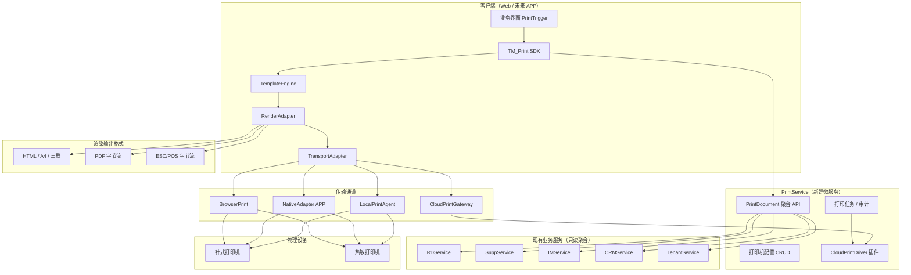
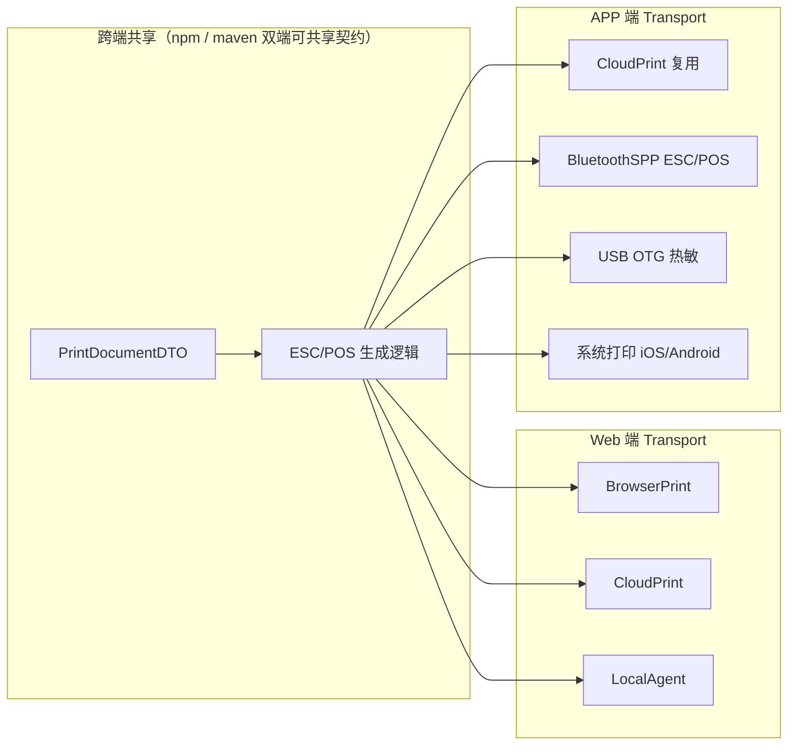
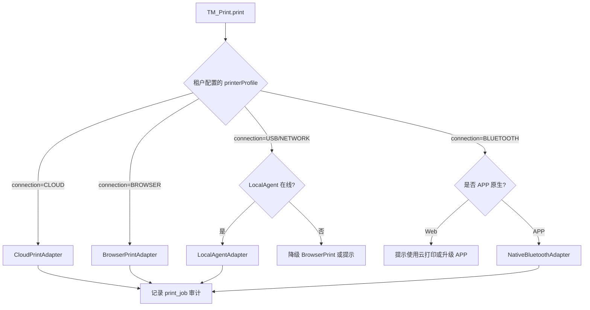
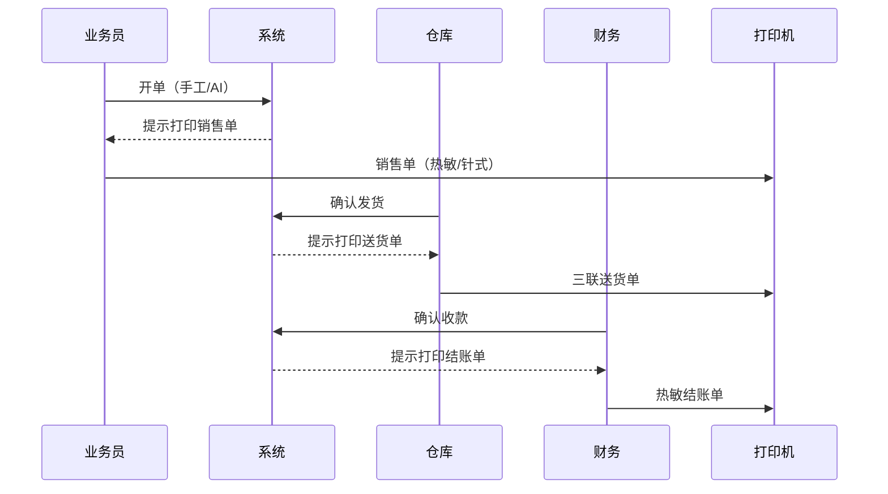

# 商贸智脑（TradeMind）打印功能扩展设计方案

| 属性 | 内容 |
|------|------|
| 文档版本 | v1.0 |
| 创建日期 | 2026-06-21 |
| 文档状态 | 方案设计（待评审） |
| 关联文档 | `spec.md`（系统概要设计）、`Framework_Guide.md`（前端架构指南）、`产品信息扩展方案设计.md` |
| 适用范围 | 批发商户（WHOLESALE）优先；架构预留电商/外贸/工贸扩展；Web 端一期 + 原生 APP 二期 |

---

## 1. 概述

### 1.1 背景

TradeMind 当前为 **Web SPA + 微服务** 架构，已实现销售订单、进货单、收付款流水等批发核心单据，但 **全库无打印相关实现**（无 ESC/POS、无打印模板、无 `window.print()`、无 PrintService）。

批发商户日常经营对打印有刚性需求：

| 业务场景 | 典型单据 | 常用打印机 |
|----------|----------|-----------|
| 开单/销售 | 销售单、报价单 | 针式三联 / 热敏小票 |
| 配货发货 | 送货单、出库单 | 针式三联 |
| 收款结算 | 结账单、收款凭证 | 热敏 58/80mm |
| 进货入库 | 进货单、入库单 | 针式 / 热敏 |
| 付款对账 | 付款凭证、对账单 | 热敏 / A4 |

同时需兼顾 **PC 端（仓库前台、办公室）** 与 **移动端（业务员外勤开单）**，并预留未来 **原生 APP（Capacitor / Flutter / RN）** 的蓝牙/USB 扩展能力。

### 1.2 设计目标

1. **内容与设备解耦**：同一笔订单可渲染为三联送货单（针式）或 58mm 结账单（热敏），仅切换模板与传输通道。
2. **传输与厂商解耦**：通过 `TransportAdapter` 插件屏蔽飞鹅云、易联云、佳博、芯烨及本地 USB 差异。
3. **复用现有单据 API**：打印不重复造业务数据，新增打印视图 DTO + 模板映射层。
4. **Web 先行、APP 预留**：一期以 Web + 云打印 + PC 浏览器打印为主；接口与 SDK 分层设计，APP 仅替换传输适配层。
5. **权限与脱敏对齐**：打印按钮走 `data-role` / `data-action`；价格字段沿用角色脱敏规则。
6. **可审计**：关键单据打印留痕（谁、何时、何单、何模板、成功/失败）。

### 1.3 非目标（本阶段不做）

- 标签机条码批量打印（CPCL/ZPL）— 可预留接口。
- 可视化拖拽模板编辑器 — 三期考虑。
- 离线断网队列（仓库无网必须打印）— 复杂度较高，单独立项。
- 全厂商 SDK 一对一集成 — 采用「通用协议 + 少量 Vendor Patch」策略。

### 1.4 核心结论（评审摘要）

| 问题 | 结论 |
|------|------|
| 是否存在跨厂商统一接口？ | **不存在单一接口**；按设备类型收敛为 ESC/POS（热敏内容层）、云打印 REST（传输层适配器）、HTML/OS 打印栈（针式/A4） |
| 一期如何快速覆盖？ | ESC/POS 模板 + 飞鹅云/易联云 Driver + PC `window.print` 三联 HTML |
| 放在哪个模块？ | 前端 `/assets/js/tm-print/`；后端新建 **PrintService**；业务界面仅加按钮 |
| APP 如何扩展？ | 复用 `IDocumentRenderer` + `PrintDocumentDTO`；新增 `NativeBluetoothAdapter` / `NativeUsbAdapter` |

---

## 2. 现状基线

### 2.1 技术架构（当前）

```
TradeMind-Web（浏览器 SPA）
    │ wrappedFetch + JWT
    ▼
Spring Cloud Gateway（RBAC + X-Tenant-Id + X-Merchant-Type）
    ▼
┌─────────────┬──────────────┬─────────────┐
│ RDService   │ SuppService  │ IMService   │
│ 销售订单     │ 进货单        │ 账户流水     │
└─────────────┴──────────────┴─────────────┘
```

- **移动端**：`MobileAdapt/TM_Responsive.js` 响应式 Web，无原生壳。
- **外部集成**：均为 HTTP 云服务（OSS、百炼 AI、短信、杭州银行），无本地硬件抽象层。
- **已有输出能力**：`html2canvas` 海报下载、`GET /api/v1/im/accounts/{id}/ledger/export` Excel 导出。

### 2.2 单据与业务触发点（可复用）

| 单据 | 服务 | 关键 API | 建议打印触发时机 |
|------|------|----------|-----------------|
| 销售订单 | RDService | `GET/POST /api/v1/rd/orders/*`、`/{id}/ship`、`/{id}/record-payment` | 保存成功、确认发货、确认收款后 |
| 进货单 | SuppService | `GET/POST /api/v1/supp/purchases/*`、`/{id}/inbound`、`/{id}/record-payment` | 保存成功、确认入库、确认付款后 |
| 账户流水 | IMService | `GET /api/v1/im/accounts/{id}/ledger` | 财务主动打印对账单 |
| 客户信息 | CRMService | `GET /api/v1/crm/customers/{id}` | 客户对账单 |

### 2.3 相关 UI 弹窗（当前）

| 弹窗 ID | 文件 | 类名特征 |
|---------|------|----------|
| `order-detail-modal` | `modules/dashboard/dashboard.html` | `tm-document-modal`、`tm-order-detail-modal` |
| `manual-order-modal` | 同上 | 新建/编辑销售订单 |
| `audit-modal` | 同上 | AI 提取订单核对 |
| `purchase-modal` | `modules/supply-chain/supply-chain.html` | `tm-purchase-modal` |
| 账户流水面板 | `modules/SmartOps/SmartOps.html` | 已有 Excel 导出按钮 |

弹窗已统一 **Bottom Sheet** 规范（`data-tm-dialog-variant="sheet"`、`tm-mobile-modal-footer`），打印控件应嵌入现有 footer / 操作区，不新增平行弹窗体系。

---

## 3. 总体架构

### 3.1 分层模型



### 3.2 设计原则

| 原则 | 说明 |
|------|------|
| 渲染与传输分离 | 先得到 `PrintPayload`，再选择通道发送 |
| 适配器插件化 | 新厂商 = 新 `ITransportAdapter` / `ICloudPrintDriver`，不改业务 |
| 配置租户隔离 | 打印机档案、默认纸宽、默认编码按 `tenant_id` 存储 |
| 失败可降级 | 云打印失败 → 预览 HTML → 浏览器打印 / 分享 PDF |
| 多端同契约 | `PrintDocumentDTO` + `PrintRequest` 为 Web/APP 唯一数据契约 |

### 3.3 跨端统一契约（Web 与 APP 共用）

```typescript
// 逻辑契约（实现语言 Java / TypeScript 均可）
interface PrintRequest {
  docType: PrintDocType;      // 见 §5.1
  docId: string;              // 订单ID / 进货单ID / 账户ID 等
  templateCode?: string;      // 可选指定模板，默认按 docType + printerProfile 推断
  printerId?: string;         // 可选，默认租户 default_printer_id
  copies?: number;          // 份数，针式三联通常为 1（物理三联）
  options?: Record<string, unknown>; // 如 { partialShipItemIds: [...] }
}

interface PrintDocumentDTO {
  docType: PrintDocType;
  docId: string;
  merchant: MerchantHeader;   // 店名、地址、电话、Logo URL
  counterparty: PartyInfo;    // 客户 / 供应商
  lines: PrintLineItem[];
  summary: PrintSummary;      // 合计、已收/未收、备注
  meta: PrintMeta;            // 单号、日期、状态、制单人
  extensions?: object;        // 业态扩展字段
}

interface PrintResult {
  success: boolean;
  jobId?: string;
  channel: 'BROWSER' | 'CLOUD' | 'AGENT' | 'NATIVE';
  message?: string;
  fallback?: 'PREVIEW_HTML' | 'SHARE_PDF';
}
```

---

## 4. 打印机类型与通用协议策略

### 4.1 类型 × 协议 × 连接方式矩阵

| 打印机类型 | 典型用途 | 内容层通用协议 | 一期推荐连接方式 | 二期扩展 |
|-----------|----------|---------------|-----------------|---------|
| 热敏票据机 58/80mm | 结账单、收款小票、简易货单 | **ESC/POS** + GB18030 | 云打印（Wi-Fi）、PC 本地代理 | APP 蓝牙 SPP |
| 针式连续纸三联 | 销售单、送货单、入库单 | **HTML 精排版**（非指令集） | PC `window.print`、本地代理+驱动 | — |
| A4 激光/喷墨 | 对账单、报表 | HTML / PDF | `window.print`、服务端 PDF | APP 系统分享 |
| 标签机 | 条码标签（非本期） | CPCL / ZPL | 暂缓 | 按需 |

**关键认知**：不存在覆盖「针式 + 热敏 + 云 + 蓝牙 + USB」的单一物理接口；通用性应做在 **内容渲染层 + 传输适配层**。

### 4.2 ESC/POS（热敏内容层标准）

国产主流热敏机（佳博、芯烨、商米、爱宝、新北洋等）普遍声明兼容 ESC/POS。

| 能力 | 指令/约定 |
|------|----------|
| 初始化 | `ESC @` (0x1B 0x40) |
| 对齐/加粗/字号 | `ESC a`、`ESC E`、`GS !` |
| 切纸 | `GS V 0`（全切）/ 半切（vendor 配置） |
| 二维码 | `GS ( k` |
| 中文 | `FS &` (0x1C 0x26) 进入汉字模式 + **GB18030** 编码 |

**Vendor Patch 项**（配置而非重写）：

| 配置键 | 默认值 | 说明 |
|--------|--------|------|
| `encoding` | `GB18030` | 少数机型需 `GBK` |
| `paperWidth` | `80` | 58 或 80（字符列数 32/48） |
| `cutMode` | `FULL` | FULL / PARTIAL / NONE |
| `lineSpacing` | `DEFAULT` | 行距微调 |

### 4.3 云打印（传输层适配器模式）

国内云打印平台（飞鹅、易联云、芯烨云、佳博云等）REST API 结构相似，无国标统一，但可采用 **Driver 插件** 统一：

```
ICloudPrintDriver
  registerPrinter(sn, key, name) → void
  print(content, printerSn, options) → jobId
  queryStatus(jobId) → PrintJobStatus
  queryPrinterStatus(sn) → ONLINE | OFFLINE | PAPER_OUT
```

**一期建议实现**：

| Driver | 优先级 | 典型用户群 |
|--------|--------|-----------|
| `FeieCloudDriver` | P0 | 外卖/POS 场景多，文档成熟 |
| `YilianCloudDriver` | P0 | 传统云打印用户 |
| `XpyunCloudDriver` | P1 | 已购芯烨云打印机商户 |
| `PoscomCloudDriver` | P1 | 佳博云打印机商户 |

开源参考：`pkg6/cloud-print`、`leapfu/cloud-printer`（PHP 生态，可借鉴 Driver 划分）。

### 4.4 针式三联（PC 打印栈）

针式机（映美、得实、爱普生 LQ 等）无统一 ESC 指令集，一期策略：

1. **HTML 模板 + `@media print` CSS** — 零驱动开发，依赖 Windows 已安装驱动。
2. **本地打印代理 `tm-print-agent`**（二期）— WebSocket 接收 HTML/PDF/RAW，调用系统 Spooler 精确套打 9.5" 连续纸。

三联语义（批发惯例）：

| 联次 | 持有方 | 典型标注 |
|------|--------|----------|
| 第一联 | 商户存根 | 「存根联」 |
| 第二联 | 财务/仓库 | 「财务联」或「仓库联」 |
| 第三联 | 客户/司机 | 「客户联」或「送货联」 |

物理三联由 **一次性进纸** 完成，系统只需输出 **一份排版正确的 HTML**，打印机自动复制三联。

### 4.5 本地打印代理（PC 热敏/针式增强）

独立轻量项目（非微服务）：

```
tm-print-agent/
  ├── 监听 ws://127.0.0.1:9527（可配置）
  ├── 探测本机打印机列表（Windows Spooler / CUPS）
  ├── 接收 PrintPayload（ESC/POS bytes | HTML | RAW text）
  └── 写入指定打印机队列
```

前端 `LocalAgentAdapter` 启动时探测代理在线状态，在线则优先于纯浏览器打印。

### 4.6 未来 APP 原生适配层



| APP 连接方式 | 技术路径 | 优先级 |
|-------------|---------|--------|
| 云打印 | 与 Web 相同 HTTP API | P0（最稳） |
| 蓝牙热敏 | 原生 BLE/SPP → 发送 ESC/POS bytes | P1 |
| USB OTG | Android 原生 USB Host API | P2 |
| 系统分享 | 生成 PDF/图片 → Share Sheet | P1（对账单） |

**注意**：iOS 对蓝牙 SPP 限制较多，APP 一期仍 **云打印优先**，蓝牙为增强。

---

## 5. 单据类型与模板体系

### 5.1 打印单据类型枚举（PrintDocType）

| dict_code | 中文名 | 默认打印机类型 | 默认模板 | 数据来源 |
|-----------|--------|---------------|----------|----------|
| `SALES_ORDER` | 销售单 | 针式三联 / 热敏 | `tpl_sales_order_triple` / `tpl_sales_order_thermal` | RDService order |
| `DELIVERY_NOTE` | 送货/出库单 | 针式三联 | `tpl_delivery_triple` | order + ship items |
| `SALES_RECEIPT` | 销售结账单 | 热敏 80mm | `tpl_receipt_80` | order + payment |
| `PAYMENT_VOUCHER` | 收款凭证 | 热敏 58/80mm | `tpl_payment_thermal` | record-payment 流水 |
| `PURCHASE_ORDER` | 进货单 | 针式 / 热敏 | `tpl_purchase_order` | SuppService purchase |
| `INBOUND_NOTE` | 入库单 | 针式 / 热敏 | `tpl_inbound_note` | purchase + inbound items |
| `PURCHASE_PAYMENT` | 付款凭证 | 热敏 | `tpl_purchase_payment` | purchase payment |
| `ACCOUNT_STATEMENT` | 账户对账单 | A4 | `tpl_account_a4` | IMService ledger |
| `CUSTOMER_STATEMENT` | 客户对账单 | A4 | `tpl_customer_statement` | CRM + orders 聚合 |
| `PICK_LIST` | 拣货清单 | 热敏 / A4 | `tpl_pick_list` | 待发货订单聚合 |

字典建议新增 **D018 PRINT_DOC_TYPE**、**D019 PRINTER_TYPE**、**D020 CONNECTION_TYPE**（InitCfgService 种子数据）。

### 5.2 模板注册结构

```json
{
  "templateCode": "tpl_delivery_triple",
  "docType": "DELIVERY_NOTE",
  "merchantTypes": ["WHOLESALE"],
  "outputFormat": "HTML",
  "paperSpec": { "type": "CONTINUOUS_TRIPLE", "widthMm": 241 },
  "roles": ["ADMIN", "WAREHOUSE", "SALES"],
  "fieldPolicy": {
    "hidePurchasePriceFor": ["SALES", "WAREHOUSE"],
    "showAmountOnDelivery": true
  }
}
```

模板文件存放：

```
TradeMind-Web/assets/print-templates/
  ├── wholesale/
  │   ├── tpl_delivery_triple.html
  │   ├── tpl_receipt_80.escpos.json
  │   └── tpl_account_a4.html
  └── _shared/
      └── merchant-header.partial.html
```

ESC/POS 模板可用 JSON 描述行块（便于非 HTML 渲染）：

```json
{
  "lines": [
    { "type": "text", "content": "{{merchant.name}}", "align": "center", "bold": true },
    { "type": "divider" },
    { "type": "text", "content": "客户：{{counterparty.name}}" },
    { "type": "table", "columns": ["product", "qty", "unit", "amount"], "source": "lines" },
    { "type": "qrcode", "content": "{{meta.docNo}}" },
    { "type": "cut" }
  ]
}
```

### 5.3 PrintDocumentDTO 字段映射（销售订单示例）

| DTO 字段 | 来源 |
|----------|------|
| `merchant.name` | `tenants.tenant_name` + 租户扩展抬头配置 |
| `merchant.phone` | `tenants.phone` |
| `merchant.logoUrl` | 租户配置 / OSS |
| `counterparty.name` | `orders.customer_name` / CRM |
| `lines[].productName` | `order_items.product_name` |
| `lines[].quantity` | `order_items.quantity` |
| `lines[].unit` | `order_items.sales_unit` |
| `lines[].unitPrice` | `order_items.unit_price`（按角色脱敏） |
| `lines[].subtotal` | 计算字段 |
| `summary.totalAmount` | `orders.total_amount` |
| `summary.receivedAmount` | 聚合 `record-payment` |
| `summary.remainingAmount` | 计算字段 |
| `meta.docNo` | `orders.order_code` |
| `meta.createdAt` | `orders.create_time` |
| `meta.logisticsStatus` | 字典 D010 文案 |
| `meta.financeStatus` | 字典 D015 文案 |
| `meta.operator` | JWT `realName` |

---

## 6. 后端设计（PrintService）

### 6.1 服务定位

新建微服务 **PrintService**（建议端口 8091），职责：

| 职责 | 说明 |
|------|------|
| 打印数据聚合 | 一次请求返回 `PrintDocumentDTO`，避免前端多服务拼装 |
| 打印机配置 CRUD | 租户级设备档案、默认机、云打印密钥托管 |
| 云打印派发 | 服务端调用 Cloud Driver（密钥不暴露给浏览器时可选） |
| 打印任务审计 | `print_jobs` 记录状态、重试、回调 |

**不** 将打印逻辑塞入 RDService / SuppService — 保持业务状态机纯粹。

### 6.2 数据库表（建议）

#### 6.2.1 打印机档案 `printer_profiles`

| 字段 | 类型 | 说明 |
|------|------|------|
| printer_id | UUID PK | |
| tenant_id | VARCHAR(32) | 租户隔离 |
| printer_name | VARCHAR(100) | 显示名，如「前台热敏」「仓库针式」 |
| printer_type | VARCHAR(32) | D019：`THERMAL` / `DOT_MATRIX` / `A4` / `LABEL` |
| vendor | VARCHAR(32) | `FEIE` / `YILIAN` / `XPYUN` / `GENERIC_ESC` / `OS_SPOOLER` |
| connection_type | VARCHAR(32) | D020：`CLOUD` / `USB` / `NETWORK` / `BLUETOOTH` / `BROWSER` |
| paper_width_mm | INT | 58 / 80 / 241 等 |
| encoding | VARCHAR(20) | 默认 GB18030 |
| cloud_sn | VARCHAR(64) | 云打印机身 SN |
| cloud_key_enc | VARCHAR(256) | 加密存储 KEY |
| vendor_config | JSONB | 切刀模式、列数、Driver 扩展参数 |
| is_default | BOOLEAN | 租户默认打印机 |
| status | VARCHAR(20) | ACTIVE / DISABLED |
| create_time / update_time | TIMESTAMP | |

#### 6.2.2 打印任务 `print_jobs`

| 字段 | 类型 | 说明 |
|------|------|------|
| job_id | UUID PK | |
| tenant_id | VARCHAR(32) | |
| user_id | INT | 操作人 |
| doc_type | VARCHAR(32) | D018 |
| doc_id | VARCHAR(64) | 业务单据 ID |
| template_code | VARCHAR(64) | |
| printer_id | UUID FK | |
| channel | VARCHAR(20) | CLOUD / BROWSER / AGENT / NATIVE |
| status | VARCHAR(20) | PENDING / SUCCESS / FAILED / CANCELLED |
| vendor_job_id | VARCHAR(128) | 云厂商返回的任务号 |
| error_message | TEXT | |
| created_at | TIMESTAMP | |

#### 6.2.3 租户打印抬头 `tenant_print_settings`

| 字段 | 类型 | 说明 |
|------|------|------|
| tenant_id | VARCHAR(32) PK | |
| shop_display_name | VARCHAR(200) | 打印店名 |
| address | VARCHAR(500) | |
| contact_phone | VARCHAR(50) | |
| footer_text | VARCHAR(500) | 小票底部致谢/免责 |
| logo_oss_key | VARCHAR(256) | |
| default_printer_id | UUID | |
| auto_print_rules | JSONB | 见 §8.4 |

### 6.3 API 设计

网关路由前缀：`/api/v1/print/**` → PrintService

| 方法 | 路径 | 权限 | 说明 |
|------|------|------|------|
| GET | `/documents/{docType}/{docId}` | 按单据权限 | 返回 `PrintDocumentDTO` |
| POST | `/jobs` | 登录用户 | 创建打印任务（云打印服务端派发） |
| GET | `/jobs/{jobId}` | 登录用户 | 查询任务状态 |
| GET | `/printers` | ADMIN | 列表 |
| POST | `/printers` | ADMIN | 新增打印机 |
| PUT | `/printers/{id}` | ADMIN | 更新 |
| DELETE | `/printers/{id}` | ADMIN | 删除 |
| POST | `/printers/{id}/test` | ADMIN | 打印测试页 |
| GET | `/settings` | ADMIN | 租户打印抬头 |
| PUT | `/settings` | ADMIN | 更新抬头与自动打印规则 |

**聚合读取示例**：

```
GET /api/v1/print/documents/DELIVERY_NOTE/{orderId}
  → PrintService 调 RDService 取订单 + CRM 取客户 + TenantService 取抬头
  → 角色脱敏后返回 PrintDocumentDTO
```

`RoutePermissionMap` 需同步注册；价格字段脱敏与 RDService DTO 策略一致。

### 6.4 CloudPrintGateway（服务端）

```java
public interface ICloudPrintDriver {
    String getVendorCode();
    void registerPrinter(PrinterProfile profile);
    String submitPrint(String sn, byte[] payload, PrintOptions options);
    PrintJobStatus queryJob(String vendorJobId);
    PrinterDeviceStatus queryDevice(String sn);
}
```

一期实现 `FeieCloudDriver`、`YilianCloudDriver`；通过 Spring `@ConditionalOnProperty` 或策略工厂按 `vendor` 路由。

---

## 7. 前端设计（Web SDK）

### 7.1 目录结构

```
TradeMind-Web/
├── assets/js/tm-print/
│   ├── tm-print-core.js           # 入口 TM_Print.print(request)
│   ├── tm-print-api.js            # PrintService API 封装
│   ├── tm-template-engine.js      # 模板选择 + 变量填充
│   ├── tm-template-registry.js    # templateCode → 渲染器映射
│   ├── render/
│   │   ├── tm-render-html.js      # HTML / 三联
│   │   ├── tm-render-escpos.js    # ESC/POS 编码
│   │   └── tm-render-pdf.js       # 可选：pdf 预览
│   └── adapters/
│       ├── browser-print.js       # window.print + iframe
│       ├── cloud-print.js         # 调 PrintService /jobs 或直连
│       ├── local-agent.js         # WebSocket → tm-print-agent
│       └── capability-probe.js    # 探测代理/云/蓝牙能力
├── assets/css/tm-print.css          # @media print 三联样式
├── assets/print-templates/          # HTML / ESC/POS JSON 模板
└── modules/print-settings/
    └── print-settings.html          # 打印机配置页（可选独立模块）
```

遵循 `Framework_Guide.md`：**业务 JS 不放 `/modules/`**。

### 7.2 核心调用 API

```javascript
// 统一入口（挂载 window.TM_Print）
await TM_Print.print({
  docType: 'DELIVERY_NOTE',
  docId: currentDetailOrderId,
  printerId: optionalPrinterId,
  options: { shipItemIds: [...] }  // 部分发货明细
});

// 仅预览（不发送）
await TM_Print.preview({ docType: 'SALES_RECEIPT', docId: orderId });

// 获取可用打印机
const printers = await TM_Print.listPrinters({ printerType: 'THERMAL' });
```

### 7.3 传输适配器选择逻辑



### 7.4 打印专用 CSS（三联针式）

```css
/* tm-print.css — 连续纸三联示例 */
@media print {
  @page { size: 241mm auto; margin: 5mm; }
  .tm-print-triple { font-family: "SimSun", serif; font-size: 10pt; }
  .tm-print-triple .copy-label { font-size: 8pt; color: #666; }
  .no-print { display: none !important; }
}
```

---

## 8. 功能界面与 UI 扩展设计

### 8.1 界面扩展总览

| 优先级 | 界面 | 文件 | 新增控件 | 角色 |
|--------|------|------|----------|------|
| **P0** | 订单详情 | `dashboard.html` → `#order-detail-modal` | 打印下拉 + 发货/收款后自动提示 | SALES, WAREHOUSE, FINANCE, ADMIN |
| **P0** | 新建订单 | `#manual-order-modal` | 保存成功后「打印销售单」 | SALES, ADMIN |
| **P0** | AI 核对 | `#audit-modal` | 确认入库后「打印销售单」 | SALES, ADMIN |
| **P0** | 进货单 | `supply-chain.html` → `#purchase-modal` | 打印下拉 + 入库/付款后提示 | WAREHOUSE, FINANCE, ADMIN |
| **P1** | 账户流水 | `SmartOps.html` | 「打印对账单」并列 Excel 导出 | FINANCE, ADMIN |
| **P1** | CRM 客户详情 | `crm.html` | 「打印客户对账单」 | FINANCE, SALES, ADMIN |
| **P2** | 工作台列表 | `dashboard.html` 订单列表 | 批量打印待发货单 | WAREHOUSE, ADMIN |
| **P2** | 产品中心 | `product-center.html` | 拣货/盘点单 | WAREHOUSE |
| **P2** | 打印设置 | 新建 `print-settings.html` 或 SmartOps 子 Tab | 打印机管理、抬头、自动打印 | ADMIN |

### 8.2 订单详情弹窗扩展（重点）

**位置**：`#order-detail-modal` 的 `tm-mobile-modal-footer`，在「保存」左侧增加打印按钮。

**桌面端布局**：

```
┌─────────────────────────────────────────────────────────┐
│ 订单详情                                    [物流][财务] │
├─────────────────────────────────────────────────────────┤
│ 客户 / 状态 / 明细表 ...                                 │
├─────────────────────────────────────────────────────────┤
│ [返回工作台]  [打印 ▾]  [保存]                           │
└─────────────────────────────────────────────────────────┘
```

**打印下拉菜单项**（按角色过滤）：

| 菜单项 | docType | 角色 | 默认打印机 |
|--------|---------|------|-----------|
| 销售单（三联） | `SALES_ORDER` | SALES, ADMIN | 针式 / 浏览器 |
| 送货单（三联） | `DELIVERY_NOTE` | WAREHOUSE, SALES, ADMIN | 针式 |
| 结账单（热敏） | `SALES_RECEIPT` | FINANCE, SALES, ADMIN | 热敏 |
| 收款凭证 | `PAYMENT_VOUCHER` | FINANCE, ADMIN | 热敏 |

**移动端**：打印按钮与下拉改为 Bottom Sheet 内 **图标按钮 + 动作列表**（`ph-printer`），保证 `min-h-[44px]` 触控区域。

**HTML 标注示例**：

```html
<div class="relative" data-role="ADMIN SALES WAREHOUSE FINANCE" data-action="PRINT_ORDER">
  <button type="button" id="detail-print-trigger" class="tm-btn-secondary ..."
    aria-haspopup="menu" aria-expanded="false">
    <i class="ph ph-printer"></i> 打印
  </button>
  <div id="detail-print-menu" class="hidden ..." role="menu">
    <button type="button" data-print-doc="SALES_ORDER" data-role="ADMIN SALES">销售单</button>
    <button type="button" data-print-doc="DELIVERY_NOTE" data-role="ADMIN SALES WAREHOUSE">送货单</button>
    <button type="button" data-print-doc="SALES_RECEIPT" data-role="ADMIN SALES FINANCE">结账单</button>
  </div>
</div>
```

逻辑放入 `assets/js/tm-print/tm-print-triggers.js`，在 `openOrderDetail()` 完成后绑定。

### 8.3 业务动作联动（自动提示打印）

| 业务动作 | 函数/API | 成功后 UX |
|----------|---------|----------|
| 确认发货 | `confirmOrderShip()` | Toast「发货成功」+ 行动点「打印送货单」 |
| 确认收款 | `recordOrderPayment()` | Toast「收款成功」+ 行动点「打印结账单」 |
| 确认入库 | `SupplierModule.confirmPartialInbound()` | 行动点「打印入库单」 |
| 确认付款 | `SupplierModule.recordPayment()` | 行动点「打印付款凭证」 |
| 保存新订单 | `saveManualOrder()` | 行动点「打印销售单」 |

使用现有 `TM_UI.showNotification` 的 action 模式（若无可扩展 `{ actionLabel, onAction }`），避免阻断主流程。

### 8.4 自动打印规则（租户配置，二期）

`tenant_print_settings.auto_print_rules` 示例：

```json
{
  "onShipSuccess": { "enabled": true, "docType": "DELIVERY_NOTE", "printerId": "..." },
  "onPaymentSuccess": { "enabled": false, "docType": "SALES_RECEIPT" }
}
```

默认全部 **关闭**，由 ADMIN 在打印设置页开启。

### 8.5 打印设置页 UI

**入口**：SmartOps 模块新增子 Tab「打印设置」，或侧栏 `data-tm-nav` 扩展（需评估导航权重）；建议首期放在 **SmartOps → 设置区**，仅 `data-role="ADMIN"` 可见。

**页面结构**：

```
打印设置
├── 店铺抬头（店名、地址、电话、底部文案、Logo 上传）
├── 打印机列表
│   ├── [+ 添加打印机]
│   └── 卡片：名称 | 类型 | 连接方式 | 默认 | 测试打印 | 编辑 | 删除
├── 添加/编辑打印机向导
│   Step1 选择类型（热敏/针式/A4）
│   Step2 选择连接（云打印/本机浏览器/本地代理）
│   Step3 厂商（飞鹅/易联云/通用ESC/系统打印机）
│   Step4 参数（SN/KEY、纸宽、编码）+ 测试页
└── 自动打印规则（开关表格）
```

**云打印绑定流程**：

1. 商户在打印机机身标签获取 SN/KEY  
2. 系统调用 `POST /api/v1/print/printers` → 后端 Driver `registerPrinter`  
3. 调用 `POST /api/v1/print/printers/{id}/test` 打印测试页  
4. 设为默认  

### 8.6 打印预览弹窗（新增）

新增 `#print-preview-modal`（放 `dashboard.html` 或独立 overlay 片段）：

```
┌──────────────────────────────────────┐
│ 打印预览 — 送货单          [×]       │
├──────────────────────────────────────┤
│ 选择打印机：[前台热敏 ▾]             │
│ ┌──────────────────────────────────┐ │
│ │  （HTML 预览 或 小票模拟区域）    │ │
│ └──────────────────────────────────┘ │
├──────────────────────────────────────┤
│ [取消]  [下载PDF]  [确认打印]        │
└──────────────────────────────────────┘
```

热敏预览用等宽字体 + 固定宽度（58mm/80mm）模拟；三联预览用分页线标注联次。

### 8.7 权限与 `data-action` 扩展

在 `ui-permissions.js` 的 `TM_ROLE_SCHEMA.ACTION` 中新增：

| action | 允许角色 |
|--------|----------|
| `PRINT_ORDER` | ADMIN, SALES, WAREHOUSE, FINANCE |
| `PRINT_PURCHASE` | ADMIN, WAREHOUSE, FINANCE |
| `PRINT_STATEMENT` | ADMIN, FINANCE |
| `MANAGE_PRINTER` | ADMIN |

---

## 9. 批发业务场景与打印映射

### 9.1 作业流 × 打印时机



### 9.2 单据 × 打印机 × 通道推荐

| 单据 | 推荐打印机 | 一期通道 | 二期通道 |
|------|-----------|---------|---------|
| 销售单 | 针式三联 / 热敏 | 浏览器 / 云打印 | 本地代理 |
| 送货单 | 针式三联 | 浏览器 | 本地代理 |
| 结账单 | 热敏 80mm | 云打印 | 本地代理 / APP 蓝牙 |
| 进货单 | 针式 | 浏览器 | 本地代理 |
| 入库单 | 针式 / 热敏 | 浏览器 / 云打印 | 本地代理 |
| 对账单 | A4 | 浏览器 | PDF 分享 |

### 9.3 角色默认打印偏好（可在用户级扩展）

| 角色 | 最常用打印 | 界面重点 |
|------|-----------|----------|
| SALES | 销售单、结账单 | 订单详情、开单弹窗 |
| WAREHOUSE | 送货单、入库单、拣货单 | 订单详情发货、进货单入库 |
| FINANCE | 结账单、收款凭证、对账单 | 订单收款、SmartOps 流水 |
| ADMIN | 全部 + 打印机配置 | 打印设置页 |

---

## 10. 未来 APP 版本架构预留

### 10.1 技术选型建议（方案层）

| 方案 | 打印扩展性 | 与现有 Web 复用 |
|------|-----------|----------------|
| **Capacitor 壳** 包 Web | 中；需原生插件 | 高，tm-print SDK 大部分可复用 |
| **Flutter / RN 独立 APP** | 高 | 中，需移植 DTO 契约与 ESC/POS 生成 |

推荐：**Capacitor + 原生打印插件** 作为 APP 一期，最大化复用 Web 业务与 `PrintDocumentDTO`。

### 10.2 APP 打印模块划分

```
app/
├── packages/print_core/        # 与 Web 共享：DTO、ESC/POS、模板 JSON
├── native/
│   ├── CloudPrintPlugin      # 复用 HTTP 调 PrintService
│   ├── BluetoothPrintPlugin  # SPP 发送 bytes
│   └── SystemPrintPlugin     # iOS UIPrintInteractionController
└── bridges/
    └── TM_Print.native.js    # 注入 window.TM_Print 的 NativeAdapter
```

Web 端 `tm-print-core.js` 检测 `window.TM_Print_Native` 存在时自动切换适配器。

### 10.3 APP 界面扩展

与 Web **同位置** 增加打印入口（订单详情、进货单、收款确认），交互遵循同一 Bottom Sheet 规范；额外增加：

| APP 专属能力 | 界面 |
|-------------|------|
| 蓝牙搜索配对 | 打印设置 → 「附近蓝牙打印机」 |
| 上次使用打印机记忆 | 本地 SecureStorage |
| 分享 PDF 对账单 | 系统 Share Sheet |

### 10.4 离线场景（远期）

若需仓库离线打印：

- APP 本地缓存最近 N 笔 `PrintDocumentDTO`  
- 离线时仅 `NativeAdapter` 可用  
- 恢复联网后补传 `print_jobs` 审计  

本方案仅预留 `print_jobs.offline_created` 字段，一期不实现。

---

## 11. 安全、审计与运维

### 11.1 安全

| 项 | 措施 |
|----|------|
| 云打印 KEY | 服务端加密存储 `cloud_key_enc`，浏览器不返回明文 |
| 打印数据权限 | 聚合 API 校验用户对单据的读权限 |
| 价格脱敏 | `PrintDocumentDTO` 生成时按 `X-User-Role` 过滤 |
| 网关 | `/api/v1/print/**` 注册 `RoutePermissionMap` |

### 11.2 审计

- 每次云打印 / 代理打印写入 `print_jobs`  
- 浏览器打印可选上报（`channel=BROWSER`，用于统计）  
- 运维后台（OpsService 扩展或 PrintService 管理接口）可查询租户打印失败率  

### 11.3 监控指标

| 指标 | 说明 |
|------|------|
| `print_job_success_rate` | 按 vendor / channel |
| `print_job_latency_p95` | 云打印派发延迟 |
| `cloud_printer_offline_count` | 设备离线数 |

---

## 12. 实施路线图

### 12.1 分期交付

| 阶段 | 范围 | 交付物 |
|------|------|--------|
| **一期（MVP）** | 批发 Web 核心打印 | PrintService 聚合 API + `printer_profiles`；ESC/POS 结账单模板；飞鹅+易联云 Driver；订单详情/进货单打印按钮；浏览器三联 HTML；打印设置基础页 |
| **二期** | PC 增强 + 财务 | `tm-print-agent`；本地 USB/网口热敏；账户/客户对账单 A4；自动打印规则；入库/付款联动 |
| **三期** | APP + 扩展厂商 | Capacitor 壳；蓝牙插件；芯烨云/佳博云 Driver；批量拣货单；打印任务中心 |
| **四期** | 体验升级 | 模板可视化编辑；标签机 CPCL；离线队列 |

### 12.2 一期任务拆解

| 序号 | 任务 | 负责层 |
|------|------|--------|
| 1 | InitCfgService 增加 D018–D020 字典 | 后端 |
| 2 | schema-production.sql 增加 3 张打印表 | 后端 |
| 3 | 新建 PrintService 微服务 + 网关路由 | 后端 |
| 4 | `PrintDocumentAggregator` 聚合 RD/Supp/CRM/Tenant | 后端 |
| 5 | FeieCloudDriver + YilianCloudDriver | 后端 |
| 6 | `tm-print-core.js` + HTML/ESC/POS 渲染器 | 前端 |
| 7 | `tm-print.css` 三联打印样式 | 前端 |
| 8 | 订单详情/进货单打印按钮与触发器 | 前端 |
| 9 | 打印设置页（SmartOps 入口） | 前端 |
| 10 | `RoutePermissionMap` + `ui-permissions.js` 扩展 | 网关+前端 |

### 12.3 依赖与风险

| 风险 | 缓解 |
|------|------|
| 针式三联套打不准 | 提供打印设置「偏移量微调」；推广 tm-print-agent |
| 云打印厂商 API 变更 | Driver 隔离；集成测试 mock |
| 手机 Web 无法蓝牙 | 一期明确引导云打印；APP 三期补蓝牙 |
| 中文字符乱码 | 统一 GB18030；测试页验收流程 |
| 打印密钥泄露 | 仅服务端持 KEY；前端走 `/print/jobs` |

---

## 13. 待评审决策项

| # | 决策点 | 建议默认值 |
|---|--------|-----------|
| 1 | 云打印密钥放前端还是服务端？ | **服务端**（`/print/jobs` 派发） |
| 2 | 打印设置入口放哪？ | **SmartOps 子 Tab**（ADMIN 可见） |
| 3 | 浏览器打印是否记审计？ | **可选上报**，默认开启 |
| 4 | APP 技术路线？ | **Capacitor 包 Web** 优先 |
| 5 | 一期是否做本地代理？ | **否**，放二期 |
| 6 | 三联单是否显示金额？ | 送货单 **可配置**；仓库角色默认隐藏进价 |

---

## 14. 附录

### 14.1 关键文件路径（实施时）

| 类别 | 路径 |
|------|------|
| 订单详情弹窗 | `TradeMind-Web/modules/dashboard/dashboard.html` |
| 进货单弹窗 | `TradeMind-Web/modules/supply-chain/supply-chain.html` |
| 账户流水 | `TradeMind-Web/modules/SmartOps/SmartOps.html` |
| 前端架构规范 | `TradeMind-Web/docs/Framework_Guide.md` |
| 订单 API | `RDService/.../OrderController.java` |
| 进货 API | `SuppService/.../PurchaseController.java` |
| 网关路由 | `trademind-gateway/src/main/resources/application.yml` |
| RBAC | `trademind-gateway/.../RoutePermissionMap.java` |

### 14.2 参考标准与外部文档

| 名称 | 说明 |
|------|------|
| ESC/POS Command Reference | Epson 官方编程手册 |
| 飞鹅云开放 API | http://www.feieyun.com/open/apidoc-cn.html |
| 易联云 API 概述 | 云打印 REST 模式 |
| GB18030 | 热敏中文编码国标 |

### 14.3 文档修订记录

| 版本 | 日期 | 修订说明 |
|------|------|----------|
| v1.0 | 2026-06-21 | 初稿：Web+APP 整体架构、适配策略、界面扩展、分期路线 |

---

*本文档为方案设计，不包含具体代码实现；评审通过后可拆分为 PrintService 概要设计、前端 SDK 接口说明、UI 线框图等子文档。*
