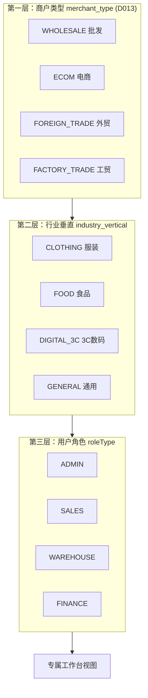
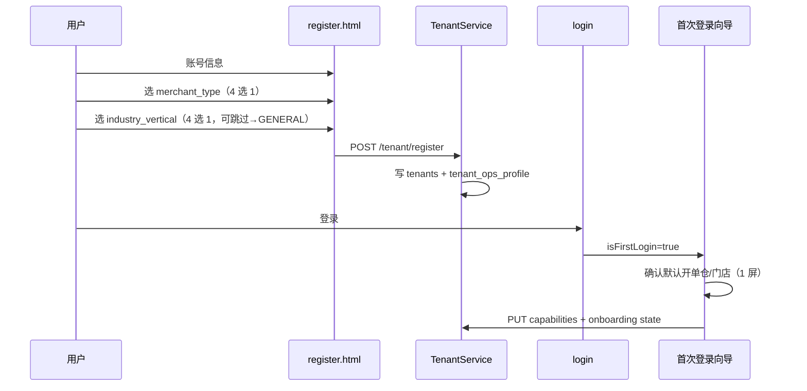
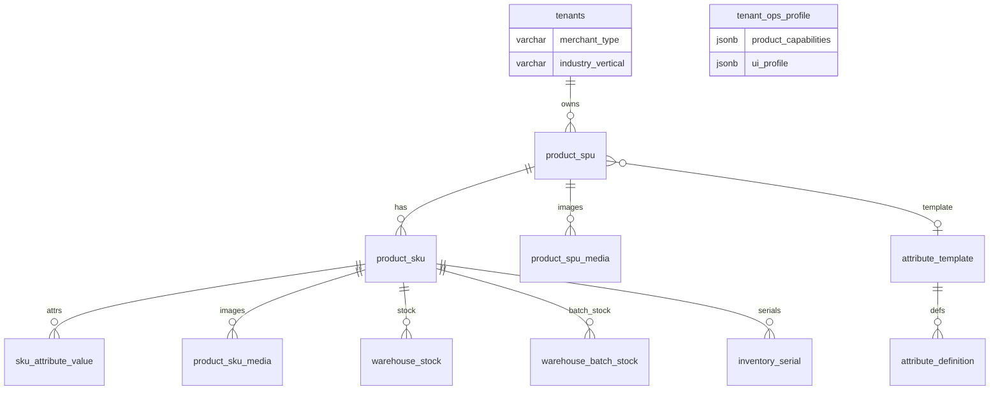

# 商贸智脑（TradeMind）批发工作台与多业态差异化扩展方案设计

| 属性 | 内容 |
|------|------|
| 文档版本 | v1.0 |
| 创建日期 | 2026-06-23 |
| 文档状态 | 方案设计（已确认决策项，待评审实施） |
| 关联文档 | `产品信息扩展方案设计.md`（v1.3）、`spec.md`、`打印功能扩展设计方案.md` |
| 适用范围 | 工作台 UI、租户/行业配置、SPU/SKU 与分仓库存、欠货/部分发货、产品图片、销售退货/退厂联动 |

---

## 0. 已确认决策项

| 序号 | 议题 | 结论 |
|------|------|------|
| 1 | 行业垂直是否与 `merchant_type` 独立 | **是**。`merchant_type`（D013 业态）与 `industry_vertical`（行业垂直）分字段存储与展示 |
| 2 | 欠货与部分发货关系 | **复用部分发货语义**。未发货数量即欠货；支持仓库→门店调度或直接物流发货；支持录入/扫码 **物流单号 + 物流品牌** |
| 3 | 快速开单位置 | **内嵌工作台概览**（非独立 Tab）；AI 提单降为辅助入口 |
| 4 | 产品图片上传 | **服务端上传**（对齐工作台识图压缩管线，非 STS 直传） |

---

## 1. 概述

### 1.1 背景

新意法批发市场等 **批发档口** 典型路径为：客户现场确认 → 店员选款/颜色/型号/数量 → **当场开单打印**。现有工作台以 AI 文本/语音/拍照提单为主视觉，手动开单入口弱，且不支持规格级快选、欠货调度、产品缩略图。

同时 SaaS 需服务 **电商、外贸、工贸** 等多业态，以及 **服装、食品、3C** 等行业垂直，若全部功能平铺会导致界面复杂。需建立 **「业态包 → 行业属性包 → 角色视图」** 三层叠加模型。

本方案在 **不推翻** 现有 `product_spu` / `product_sku`、销售退货、供应商退厂 已落地能力的前提下，给出数据表扩展与界面扩展的详细设计。

### 1.2 设计目标

1. **批发主路径**：工作台概览内嵌「快速开单」，秒级选 SKU、看门店/仓库存、保存并打印。
2. **AI 保留**：语音/拍照/文本提单收至「AI 补录」区，服务事后录入与大单整理。
3. **欠货即部分发货**：不新增独立 backorder 单据类型；扩展 `order_items` 与物流子表。
4. **三层差异化**：同一套 DOM/路由，通过配置裁剪可见模块与列，而非维护多套前端。
5. **行业属性数据化**：服装（颜色/尺码）、食品（口味/批次/效期）、3C（规格/序列号）共用 SPU/SKU/属性模板模型。
6. **产品图片**：SPU 主图 + SKU 规格图，OSS 按 `商户/SPU` 目录存储，服务端上传。

### 1.3 非目标（本阶段不做）

- 独立 PDA 原生 App（Web 扫码 + 扫枪 wedge 优先）。
- 完整 BOM/生产排程（工贸另案）。
- 可视化拖拽开单布局编辑器。
- 退货/退厂凭证图片（P2 可选）。

---

## 2. 三层差异化模型

### 2.1 叠加关系（对齐产品流程图）



**语义划分**：

| 维度 | 存储位置 | 决定什么 |
|------|----------|----------|
| **merchant_type** | `tenants.merchant_type` | 模块包：工作台/CRM/供货/智能经营/是否展示 API 与订单抓取等 |
| **industry_vertical** | `tenants.industry_vertical`（**新增**） | 属性模板默认值、`product_capabilities` 预填、开单/列表 **额外列** |
| **product_capabilities** | `tenant_ops_profile.product_capabilities` | 租户是否允许启用规格/效期/序列号（用户可关） |
| **roleType** | JWT / `users` | Tab、按钮、字段脱敏（现有 `ui-permissions.js` + `ui-role-engine.js`） |

### 2.2 各层默认能力矩阵

#### 2.2.1 商户类型 → 功能包

| merchant_type | 工作台主区块 | 默认 Tab | 弱化/隐藏 |
|---------------|-------------|----------|-----------|
| WHOLESALE | 内嵌快速开单 + 欠货/进行中 | dashboard, crm, supply | — |
| ECOM | 订单同步/API 看板 | dashboard, supply | 档口式快速开单（可配置开） |
| FOREIGN_TRADE | 报关/箱唛/多币种（P2） | crm, supply, supplier | 国内欠货调拨 |
| FACTORY_TRADE | 生产/BOM 入口（另案） | supply, supplier | 零售开单 |

#### 2.2.2 行业垂直 → 属性包与能力默认

| industry_vertical | 系统属性模板 | product_capabilities 默认 | SPU 建议 track_* |
|-------------------|-------------|---------------------------|------------------|
| CLOTHING | 颜色 + 尺码 | allowVariants=true | track_variants |
| FOOD | 口味 + 规格 + 批次效期 | allowVariants=true, allowExpiry=true | track_variants, track_expiry |
| DIGITAL_3C | 颜色 + 容量 | allowVariants=true, allowSerial=true | track_variants, track_serial |
| GENERAL | 无（单 SKU） | 全 false | 全 false |

#### 2.2.3 角色 → 工作台可见性

| 角色 | 概览-快速开单 | 欠货/调度 | AI 补录 | 销售订单 | 退货 | 收款 |
|------|--------------|----------|---------|----------|------|------|
| ADMIN | ✅ | ✅ | ✅ | ✅ | ✅ | ✅ |
| SALES | ✅ | ✅ 只读欠货 | ✅ | ✅ | 申请 | 隐藏 |
| WAREHOUSE | ❌ | ✅ 调度/发货 | ❌ | 只读 | 验收 | ❌ |
| FINANCE | ❌ | ❌ | ❌ | ✅ | 冲账 | ✅ |

---

## 3. 行业选择：注册与首次登录

### 3.1 流程（≤3 屏）



### 3.2 新增/扩展字段

```sql
-- tenants 表扩展
ALTER TABLE tenants ADD COLUMN IF NOT EXISTS industry_vertical VARCHAR(32) NOT NULL DEFAULT 'GENERAL';
-- 枚举：CLOTHING | FOOD | DIGITAL_3C | GENERAL

ALTER TABLE tenants ADD COLUMN IF NOT EXISTS industry_selected_at TIMESTAMP;

-- tenant_ops_profile 扩展（与现有 product_capabilities JSONB 并存）
ALTER TABLE tenant_ops_profile ADD COLUMN IF NOT EXISTS ui_profile JSONB NOT NULL DEFAULT '{}'::jsonb;
```

**`ui_profile` 建议结构**：

```json
{
  "defaultFulfillmentWarehouseId": 12,
  "defaultStoreWarehouseId": 12,
  "quickOrderPrintTemplate": "RECEIPT_58",
  "showAiExtract": true,
  "onboardingCompletedAt": "2026-06-23T10:00:00Z"
}
```

### 3.3 注册 API 扩展

`POST /api/v1/tenant/register` 请求体增加：

```json
{
  "merchantType": "WHOLESALE",
  "industryVertical": "CLOTHING",
  "companyName": "...",
  "username": "...",
  "password": "..."
}
```

服务端逻辑：

1. 校验 `merchantType` ∈ D013 白名单。
2. 校验 `industryVertical` ∈ `{CLOTHING, FOOD, DIGITAL_3C, GENERAL}`。
3. 按 **§2.2.2** 写入 `tenant_ops_profile.product_capabilities` 初始值（用户后续可在设置中修改）。
4. 按行业绑定 `attribute_template` 系统模板 ID（见 §5.3）。

**老租户兼容**：`industry_vertical` 默认 `GENERAL`；不强制弹窗，设置页可补选。

---

## 4. 工作台界面扩展（内嵌概览）

### 4.1 概览 Tab 布局（WHOLESALE + SALES/ADMIN）

```
┌──────────────────────────────────────────────────────────────────┐
│  KPI 条（可折叠，一行四指标）                                        │
├──────────────────────────────────────────────────────────────────┤
│  【快速开单】  id=workbench-quick-order-panel                       │
│  ┌────────────────────────────────────────────────────────────┐  │
│  │ 客户 [▼]  履约门店/仓 [▼]  交货日期                          │  │
│  │ ─────────────────────────────────────────────────────────  │  │
│  │ [图] 款名  颜色▼ 尺码▼  数量  单价  小计  [门店][仓库][欠]      │  │
│  │ [图] ...                                                    │  │
│  │ [+ 加一行]  [扫条码]                                         │  │
│  │ ─────────────────────────────────────────────────────────  │  │
│  │ 应收 ¥xxx   [保存并打印] [保存待发] [清空]                      │  │
│  └────────────────────────────────────────────────────────────┘  │
├────────────────────────────┬─────────────────────────────────────┤
│  AI 补录（折叠）              │  进行中 / 欠货                       │
│  [文本][语音][拍照]           │  #inprogress-list + 欠货徽章         │
│  → 待确认列表                 │  点击 → order-detail-modal          │
└────────────────────────────┴─────────────────────────────────────┘
```

**与现有 DOM 关系**：

| 现有 | 变更 |
|------|------|
| `#dashboard-ai-extract` | 移入 `#workbench-ai-supplement` 折叠区，默认收起 |
| `#manual-order-modal` | 保留；快速开单内嵌区与之 **共用** `TM_saveManualOrder` / 行编辑逻辑 |
| `#workbench-overview-panel` | 顶部插入 `#workbench-quick-order-panel` |
| `#inprogress-list` | 卡片增加「含欠货」徽章 |

### 4.2 快速开单行 UI（按行业差异化列）

DOM 标记约定（供 `ui-role-engine` / 新模块 `tm-workbench-profile.js` 裁剪）：

```html
<tr data-tm-industry-col="variant" class="...">  <!-- 服装/3C -->
<tr data-tm-industry-col="batch" class="...">    <!-- 食品 -->
<tr data-tm-industry-col="serial" class="...">   <!-- 3C 发货阶段 -->
```

| industry_vertical | 开单表格列 |
|-------------------|-----------|
| GENERAL | 产品/SKU、数量、单价、小计、门店库存、仓库库存 |
| CLOTHING | + 颜色 Chip、尺码 Chip、`attributes_display` |
| FOOD | + 口味/规格；发货时选批次（效期） |
| DIGITAL_3C | + 颜色/容量；发货时序列号扫码 |

**产品展示**：

- 行首 40×40 缩略图：优先 `product_sku_media` → `product_spu_media(COVER)` → 占位图。
- 搜款：支持 SPU 名 / SKU 码 / 条码；数据源 `GET /api/v1/rd/products/skus/options`（已含 `attributes`、`track_*`）。

### 4.3 AI 补录区（保留）

- 文本 / 语音 / 拍照 三入口不变，链路不变：`POST /api/v1/ai/execute` → 待确认 → 审核 → 下单。
- 视觉降级：折叠标题「AI 补录（适合事后整理大单）」。
- `data-tm-merchant`：ECOM 可隐藏语音档口入口。

### 4.4 其他 Tab（不变更 IA）

- **销售订单**：全量分页列表（§18 既有方案）。
- **退货单**：独立 Tab，与开单解耦。
- 订单详情 / 手动弹窗：继续复用 `#order-detail-modal`、`#manual-order-modal` 作为深链与移动端全屏兜底。

### 4.5 前端模块划分（建议）

| 模块 | 职责 |
|------|------|
| `tm-workbench-profile.js` | 读取 JWT + `/products/capabilities` + `industry_vertical`，输出 `TM_WorkbenchProfile` |
| `workbench-quick-order.js` | 内嵌开单：行编辑、库存查询、保存、打印触发 |
| `dashboard-workbench.js` | 待确认 Store、手动下单 API（现有，被 quick-order 调用） |
| `ui-role-engine.js` | 扩展：识别 `data-tm-industry-col`、`data-tm-merchant` |

---

## 5. 数据表设计：多业态 × 多行业产品模型

### 5.1 总览 ER



**既有表**（`schema-production.sql`）：`product_spu`、`product_sku`、`attribute_template`、`attribute_definition`、`sku_attribute_value`、`warehouse_stock`、`inventory_batch`、`warehouse_batch_stock`、`inventory_serial` — **继续作为核心**，本方案仅 **扩展列/新表**，不替换。

### 5.2 租户与配置表

#### `tenants`（扩展）

| 列 | 类型 | 说明 |
|----|------|------|
| `merchant_type` | VARCHAR(50) | 已有，D013：WHOLESALE / ECOM / FOREIGN_TRADE / FACTORY_TRADE |
| `industry_vertical` | VARCHAR(32) | **新增**，默认 GENERAL |

#### `tenant_ops_profile`（扩展）

| 列 | 类型 | 说明 |
|----|------|------|
| `product_capabilities` | JSONB | 已有 `{allowVariants, allowExpiry, allowSerial}` |
| `ui_profile` | JSONB | **新增**，默认开单仓、打印模板等 |

**`product_capabilities` 初始化规则**（注册/改行业时）：

```
capabilities = MERGE(merchant_type 默认值, industry_vertical 默认值, 用户显式修改)
```

### 5.3 属性模板与行业种子

系统模板（`attribute_template.is_system = TRUE`）：

| 模板 code | 名称 | attribute_definition |
|-----------|------|----------------------|
| `SYS_CLOTHING` | 服装规格 | 颜色(ENUM,matrix)、尺码(ENUM,matrix) |
| `SYS_FOOD` | 食品规格 | 口味(ENUM,matrix)、规格(ENUM,matrix) |
| `SYS_DIGITAL_3C` | 3C规格 | 颜色(ENUM,matrix)、容量(ENUM,matrix) |

**`product_categories` 联动**（已有列扩展使用）：

| 列 | 用途 |
|----|------|
| `default_template_id` | 该分类新建 SPU 时默认模板 |
| `suggest_track_expiry` | 食品类分类默认勾选效期 |
| `suggest_track_serial` | 3C 类分类默认勾选序列号 |

**注册时**：`industry_vertical=CLOTHING` → 租户默认关联 `SYS_CLOTHING`；建品时自动带出模板。

### 5.4 SPU / SKU 层（按行业）

#### `product_spu`（已有，按行业填 track_*）

| 行业 | track_variants | track_expiry | track_serial | 其他 |
|------|----------------|--------------|--------------|------|
| 服装 | true | false | false | `default_template_id` → 服装模板 |
| 食品 | true | true | false | `default_shelf_life_days`, `expiry_policy=FEFO` |
| 3C | true | false | true | `serial_outbound_mode=STRICT` |
| 通用 | false | false | false | 单默认 SKU |

#### `product_sku` + `sku_attribute_value`

- **一条 SPU，多属性组合 → 多 SKU**：笛卡尔积生成（已有 `AttributeTemplateService.generateSkusFromMatrix`）。
- 每 SKU 一行 `sku_attribute_value`，例：`(sku_id=101, 颜色=红色)`, `(sku_id=101, 尺码=M)`。
- **展示用冗余**：`order_items.attributes_display` = `红色 / M`（已有列）。

#### 库存：SKU × 仓库

| 表 | 粒度 | 说明 |
|----|------|------|
| `warehouse_stock` | sku_id × warehouse_id × stock_type | **目标汇总层**；`stock` 为可售数量 |
| `warehouse_batch_stock` | + batch_id | 食品效期行业启用 |
| `inventory_serial` | 单件 | 3C 行业启用；租户内 serial_no 唯一 |

**SPU 总库存**（展示，非独立账）：

```text
SPU.total_stock = Σ SKU.stock
SKU.stock       = Σ warehouse_stock.quantity (SELLABLE)
                ≈ Σ warehouse_batch_stock (若 track_expiry)
                ≈ COUNT(inventory_serial IN_STOCK) (若 track_serial STRICT)
```

**分仓列表展示**（产品中心 / 开单库存提示）：

```sql
-- 某 SKU 在各仓库存
SELECT w.name, ws.stock
FROM warehouse_stock ws
JOIN warehouse w ON w.warehouse_id = ws.warehouse_id
WHERE ws.sku_id = :skuId AND ws.stock_type = 'SELLABLE';
```

**迁移要求**（实施 P1）：`InventoryService` 主写入路径从 `product_id` 切到 `sku_id`（见 `产品信息扩展方案设计.md` §6）。

### 5.5 产品图片（新增表 + 服务端上传）

#### 5.5.1 表结构

```sql
CREATE TABLE IF NOT EXISTS product_spu_media (
    media_id      SERIAL PRIMARY KEY,
    tenant_id     VARCHAR(32) NOT NULL REFERENCES tenants(tenant_id),
    spu_id        INT NOT NULL REFERENCES product_spu(spu_id) ON DELETE CASCADE,
    media_type    VARCHAR(16) NOT NULL DEFAULT 'COVER',  -- COVER | GALLERY | DETAIL
    object_key    VARCHAR(512) NOT NULL,
    url           VARCHAR(1024),
    sort_order    INT NOT NULL DEFAULT 0,
    width         INT,
    height        INT,
    file_size     INT,
    create_time   TIMESTAMP DEFAULT CURRENT_TIMESTAMP,
    update_time   TIMESTAMP DEFAULT CURRENT_TIMESTAMP
);

CREATE TABLE IF NOT EXISTS product_sku_media (
    media_id      SERIAL PRIMARY KEY,
    tenant_id     VARCHAR(32) NOT NULL REFERENCES tenants(tenant_id),
    sku_id        INT NOT NULL REFERENCES product_sku(sku_id) ON DELETE CASCADE,
    object_key    VARCHAR(512) NOT NULL,
    url           VARCHAR(1024),
    sort_order    INT NOT NULL DEFAULT 0,
    width         INT,
    height        INT,
    file_size     INT,
    create_time   TIMESTAMP DEFAULT CURRENT_TIMESTAMP,
    CONSTRAINT uq_sku_media_one_cover UNIQUE (sku_id)  -- 每 SKU 一张规格图（P1）
);

CREATE INDEX IF NOT EXISTS idx_spu_media_spu ON product_spu_media(spu_id);
CREATE INDEX IF NOT EXISTS idx_sku_media_sku ON product_sku_media(sku_id);
```

#### 5.5.2 OSS 路径（服务端上传）

根前缀沿用 `trade-mind`（`OssMediaPaths` / `tm-oss-path.js`）：

```text
trade-mind/product/{tenantId}/{spuId}/cover-{timestamp}.jpg
trade-mind/product/{tenantId}/{spuId}/gallery-{index}-{timestamp}.jpg
trade-mind/product/{tenantId}/{spuId}/sku-{skuId}-{timestamp}.jpg
```

#### 5.5.3 API

| 方法 | 路径 | 说明 |
|------|------|------|
| POST | `/api/v1/rd/products/media/upload` | multipart，`spuId`/`skuId`/`mediaType`；服务端压缩（复用 AIService 压缩参数，宽 800–1200px） |
| GET | `/api/v1/rd/products/spu/{id}/media` | SPU 图集 |
| DELETE | `/api/v1/rd/products/media/{mediaId}` | 删除 |

**展示优先级**：开单/列表缩略图 = `product_sku_media` → `product_spu_media(COVER)` → 默认占位。

### 5.6 不同商户类型 × 行业的产品列表展示

| merchant_type | industry | 产品中心列表列 | SPU 视图徽章 |
|---------------|----------|---------------|-------------|
| WHOLESALE | CLOTHING | 缩略图、SPU名、SKU数、**规格摘要**、门店库存、仓库库存 | 多规格 |
| WHOLESALE | FOOD | + **效期**、临期预警 | 批次 |
| WHOLESALE | DIGITAL_3C | + **序列号** | 序列号 |
| WHOLESALE | GENERAL | 名称、SKU、单价、总库存 | — |
| ECOM | * | + 外链/API SKU 映射列（P2） | — |
| FOREIGN_TRADE | * | + 报关品名/HS（P2） | — |

**查询视图**（SPU 列表 API 扩展）：

```sql
SELECT sp.spu_id, sp.name, sp.track_variants, sp.track_expiry, sp.track_serial,
       COUNT(sk.sku_id) AS sku_count,
       SUM(ws.stock) AS total_stock,
       (SELECT url FROM product_spu_media m WHERE m.spu_id=sp.spu_id AND m.media_type='COVER' LIMIT 1) AS cover_url
FROM product_spu sp
LEFT JOIN product_sku sk ON sk.spu_id = sp.spu_id
LEFT JOIN warehouse_stock ws ON ws.sku_id = sk.sku_id AND ws.stock_type='SELLABLE'
WHERE sp.tenant_id = :tenantId
GROUP BY sp.spu_id;
```

---

## 6. 欠货与部分发货（复用现有字段）

### 6.1 语义统一

| 业务说法 | 系统语义 |
|----------|----------|
| 欠货 | `quantity - processed_qty > 0` 且 `item_status` 为待处理/异常 |
| 部分发货 | 订单头 `order_status = D010006`（已有） |
| 门店无货、仓库有货 | 开单时 `fulfillment_warehouse_id`（门店）库存不足，标记行欠货，调度源仓发货 |

**不新增** `backorder` 主表；**扩展** `order_items` 与 **新增** 行级物流子表。

### 6.2 `order_items` 扩展列

在现有列（`quantity`, `processed_qty`, `is_processed`, `sku_id`, `attributes_display` 等）基础上：

```sql
ALTER TABLE order_items ADD COLUMN IF NOT EXISTS shortage_qty INT NOT NULL DEFAULT 0;
-- shortage_qty = quantity - processed_qty - cancelled_qty（生成列或服务层维护）

ALTER TABLE order_items ADD COLUMN IF NOT EXISTS item_exception_code VARCHAR(50) DEFAULT NULL;
-- D011004 EXCEPTION（缺货/欠货）等，对齐 spec 明细字典

ALTER TABLE order_items ADD COLUMN IF NOT EXISTS fulfillment_plan VARCHAR(32) DEFAULT NULL;
-- STORE_PICKUP | WH_TO_STORE | EXPRESS | HOLD

ALTER TABLE order_items ADD COLUMN IF NOT EXISTS source_warehouse_id INT REFERENCES warehouse(warehouse_id);
-- 欠货调度：货物从哪仓发出

ALTER TABLE order_items ADD COLUMN IF NOT EXISTS target_warehouse_id INT REFERENCES warehouse(warehouse_id);
-- 欠货调度：调拨/发货目标（门店）
```

**行状态关系**：

```text
requested   = quantity
shipped     = processed_qty
shortage    = quantity - processed_qty - returned_qty（未发且未退）
```

开单保存时：若门店仓库存 < 数量，自动 `shortage_qty = 缺口`，`item_exception_code = D011004`，订单头置 `D010006`。

### 6.3 订单行物流（扫码单号）

```sql
CREATE TABLE IF NOT EXISTS order_item_shipment (
    shipment_id       SERIAL PRIMARY KEY,
    tenant_id         VARCHAR(32) NOT NULL REFERENCES tenants(tenant_id),
    order_id          INT NOT NULL REFERENCES orders(order_id) ON DELETE CASCADE,
    item_id           INT NOT NULL REFERENCES order_items(item_id) ON DELETE CASCADE,
    shipment_type     VARCHAR(16) NOT NULL DEFAULT 'EXPRESS',  -- EXPRESS | TRANSFER | SELF_PICKUP
    logistics_brand   VARCHAR(64),   -- 顺丰/中通/自配送 等，字典 D022
    tracking_no       VARCHAR(128),
    from_warehouse_id INT REFERENCES warehouse(warehouse_id),
    to_warehouse_id   INT REFERENCES warehouse(warehouse_id),
    shipped_qty       INT NOT NULL DEFAULT 0,
    shipped_at        TIMESTAMP,
    operator_user_id  INT REFERENCES users(user_id),
    remark            TEXT,
    create_time       TIMESTAMP DEFAULT CURRENT_TIMESTAMP
);

CREATE INDEX IF NOT EXISTS idx_order_item_shipment_order ON order_item_shipment(order_id);
CREATE INDEX IF NOT EXISTS idx_order_item_shipment_tracking ON order_item_shipment(tenant_id, tracking_no);
```

**作业流**：

1. **仓库→门店调拨**：生成 `ProductController.transfer` + `shipment_type=TRANSFER`，完成后对行 `processed_qty += n`。
2. **直接快递**：仓管在欠货行点「发货」→ 扫/输 `tracking_no` + 选 `logistics_brand` → 写 `order_item_shipment` → 扣源仓库存 → 增加 `processed_qty`。
3. **客户自提**：`shipment_type=SELF_PICKUP`，可不打物流单号。

### 6.4 订单头扩展（可选）

```sql
ALTER TABLE orders ADD COLUMN IF NOT EXISTS fulfillment_warehouse_id INT REFERENCES warehouse(warehouse_id);
-- 开单所选「门店/履约仓」

ALTER TABLE orders ADD COLUMN IF NOT EXISTS has_shortage BOOLEAN NOT NULL DEFAULT FALSE;
-- 列表「含欠货」徽章
```

### 6.5 与退货/退厂衔接

| 场景 | 规则 |
|------|------|
| 未发欠货 | 客户取消 → 减少 `quantity` 或标记取消，**不走**销售退货 |
| 已发后退货 | 现有 `sales_returns` + `returned_qty`；3C 退 `serial_refs` 回绑 |
| 退厂 | `supplier_returns` 按 `sku_id`/批次扩展（P2） |

---

## 7. 界面扩展清单（按模块）

### 7.1 工作台 `dashboard.html`

| 区域 | 扩展 |
|------|------|
| `#workbench-overview-panel` | 新增 `#workbench-quick-order-panel` |
| `#dashboard-ai-extract` | 迁入 `#workbench-ai-supplement`，默认折叠 |
| `#inprogress-list` | 卡片 badge：`含欠货`（`orders.has_shortage`） |
| `#order-detail-modal` | 欠货行展示调度计划、物流单号列表；发货按钮调 `order_item_shipment` |
| 手动/快速开单 | 共用行组件；列按 `TM_WorkbenchProfile.industryVertical` 显隐 |

### 7.2 产品中心 `product-overlays.html` + `product-registry-form.html`

| 区域 | 扩展 |
|------|------|
| 基本信息区 | SPU 主图上传（封面） |
| 行业能力区 | 三块卡片（规格/效期/序列号），按 `product_capabilities` + 行业默认展示 |
| 规格矩阵 | 每 SKU 行增加「规格图」上传 |
| SPU 列表 | 缩略图列、行业徽章（多规格/批次/序列号） |

### 7.3 供货/进货 `supply-chain.html`

| 行业 | 扩展 |
|------|------|
| FOOD | 进货行批次、生产日期、效期 |
| DIGITAL_3C | 进货序列号扫码录入 |
| CLOTHING | SKU 维度进货 |

### 7.4 全局壳层 `index-app.html` / `ui-main.js`

| 项 | 扩展 |
|----|------|
| JWT 解析 | 增加 `industryVertical` → `TM_UI_CONTEXT` |
| `data-tm-industry-col` | 与 `data-tm-nav` 同样由引擎裁剪 |
| 注册页 | 业态 + 行业两步选择 |

### 7.5 打印联动

快速开单「保存并打印」调用 `打印功能扩展设计方案.md` 的 Web 打印 / 云打印接口；模板含 SKU 规格摘要与缩略图（可选）。

---

## 8. API 汇总（新增/扩展）

| 域 | 方法 | 路径 | 说明 |
|----|------|------|------|
| 租户 | POST | `/api/v1/tenant/register` | + `industryVertical` |
| 租户 | GET/PUT | `/api/v1/tenant/profile` | 读/改行业、ui_profile |
| 产品 | POST | `/api/v1/rd/products/media/upload` | 服务端图片上传 |
| 产品 | GET | `/api/v1/rd/products/spu/{id}/media` | 图集 |
| 产品 | GET | `/api/v1/rd/products/skus/options` | 已有；扩展返回 `cover_url` |
| 订单 | POST | `/api/v1/rd/orders` | 快速开单；写 shortage、fulfillment_warehouse |
| 订单 | POST | `/api/v1/rd/orders/{id}/ship` | 已有；扩展 item 级 shipment |
| 订单 | POST | `/api/v1/rd/orders/{id}/items/{itemId}/shipment` | 物流单号/品牌 |
| 订单 | GET | `/api/v1/rd/orders/shortage` | 欠货看板列表（warehouse 角色） |
| 库存 | POST | `/api/v1/rd/inventory/adjust` | P1：主路径 sku_id |

---

## 9. 实施分期

| 阶段 | 交付 | 依赖 |
|------|------|------|
| **P0** | `industry_vertical` 字段 + 注册/首登向导；工作台内嵌快速开单（GENERAL 单 SKU）；AI 折叠 | TenantService、dashboard 前端 |
| **P0** | 产品图片表 + 上传 API + 产品中心封面 | RDService、AIService 压缩复用 |
| **P1** | 行业属性模板种子 + 开单规格列（服装/食品/3C）；`skus/options` 带图 | AttributeTemplate 种子 |
| **P1** | 欠货字段 + 部分发货联动 + `order_item_shipment` + 欠货徽章 | OrderService |
| **P1** | 库存写入切 sku_id | InventoryService |
| **P2** | 打印模板、3C 发货 STRICT、退货序列号回绑完整 | 打印方案、ReturnService |
| **P2** | ECOM/外贸/工贸差异化包 | 各模块 |

---

## 10. 附录 A：字典与枚举

| 编码 | 值 | 说明 |
|------|-----|------|
| D013 | merchant_type | WHOLESALE / ECOM / FOREIGN_TRADE / FACTORY_TRADE |
| — | industry_vertical | CLOTHING / FOOD / DIGITAL_3C / GENERAL |
| D010006 | order_status | 部分发货（含欠货） |
| D011004 | item_exception | 缺货/欠货 |
| D022 | logistics_brand | 物流品牌（待种子：顺丰、中通、韵达、自配送…） |

---

## 11. 附录 B：关键文件路径（实施时）

| 类型 | 路径 |
|------|------|
| DDL | `InitCfgService/src/main/resources/db/schema-production.sql` |
| 种子 | `InitCfgService/src/main/resources/db/seed-data.sql` |
| 工作台 UI | `TradeMind-Web/modules/dashboard/dashboard.html` |
| 工作台 JS | `TradeMind-Web/assets/js/dashboard-workbench.js`（+ 新建 `workbench-quick-order.js`） |
| 产品表单 | `TradeMind-Web/modules/fragments/product-registry-form.html` |
| 产品增强 | `TradeMind-Web/assets/js/ui-product-center-enhance.js` |
| 订单服务 | `RDService/.../service/OrderService.java` |
| 租户 | `TenantService/.../service/TenantService.java` |
| OSS | `AIService/.../util/OssMediaPaths.java`、`TradeMind-Web/assets/js/tm-oss-path.js` |
| 关联方案 | `TradeMind-Web/.trae/documents/产品信息扩展方案设计.md` |

---

## 12. 附录 C：评审检查表

- [ ] `industry_vertical` 与 `merchant_type` 独立存储，注册流程 3 屏内完成
- [ ] 快速开单内嵌概览，AI 降为折叠辅助
- [ ] 欠货不新建 backorder 表，复用 `processed_qty` / `D010006` / `D011004`
- [ ] 物流单号、物流品牌可扫码录入，落 `order_item_shipment`
- [ ] 服装/食品/3C 共用 SPU/SKU/属性模板，分行业默认模板与 track_*
- [ ] SKU×仓库存为记账目标，SPU 总库存为汇总展示
- [ ] 产品图服务端上传，OSS 路径 `trade-mind/product/{tenantId}/{spuId}/...`
- [ ] 界面通过 `data-tm-industry-col` / `data-tm-merchant` / RBAC 裁剪，非多套 SPA

---

*文档结束*
